## Table of Contents
* Table of Contents
{:toc}

--------------------------------------------------------------------------------------------------------------------
<div style="page-break-after: always;"></div>

## **Acknowledgements**
[<sub><sup>Back to top</sup></sub>](#table-of-contents)

* We utilise an open-source CSV (comma-separated values) parser library called **Opencsv** to help aid the implementation
  of our [import-csv command](#import-csv-feature). Click [here](http://opencsv.sourceforge.net/#general) to find out more about Opencsv.

--------------------------------------------------------------------------------------------------------------------

## **Setting up, getting started**
[<sub><sup>Back to top</sup></sub>](#table-of-contents)

Refer to the guide [_Setting up and getting started_](SettingUp.md).

--------------------------------------------------------------------------------------------------------------------
<div style="page-break-after: always;"></div>

## **Design**
[<sub><sup>Back to top</sup></sub>](#table-of-contents)

<div markdown="span" class="alert alert-primary">

:bulb: **Tip:** The `.puml` files used to create diagrams in this document can be found in the [diagrams](https://github.com/AY2122S2-CS2103T-W12-1/tp/tree/master/docs/diagrams) folder. Refer to the [_PlantUML Tutorial_ at se-edu/guides](https://se-education.org/guides/tutorials/plantUml.html) to learn how to create and edit diagrams.
</div>

### Architecture
[<sub><sup>Back to top</sup></sub>](#table-of-contents)

<p align="center">
 <br>
<b>Fig. 1 - Overall Architecture</b>
</p>

The ***Architecture Diagram*** given above explains the high-level design of the App.

Given below is a quick overview of main components and how they interact with each other.

**Main components of the architecture**

**`Main`** has two classes called [`Main`](https://github.com/AY2122S2-CS2103T-W12-1/tp/blob/master/src/main/java/seedu/address/Main.java) and [`MainApp`](https://github.com/AY2122S2-CS2103T-W12-1/tp/blob/master/src/main/java/seedu/address/MainApp.java). It is responsible for,
* At app launch: Initializes the components in the correct sequence, and connects them up with each other.
* At shut down: Shuts down the components and invokes cleanup methods where necessary.

[**`Commons`**](#common-classes) represents a collection of classes used by multiple other components.

The rest of the App consists of four components.

* [**`UI`**](#ui-component): The UI of the App.
* [**`Logic`**](#logic-component): The command executor.
* [**`Model`**](#model-component): Holds the data of the App in memory.
* [**`Storage`**](#storage-component): Reads data from, and writes data to, the hard disk.


**How the architecture components interact with each other**

The *Sequence Diagram* below shows how the components interact with each other for the scenario where the user issues the command `delete 1`.

<p align="center">
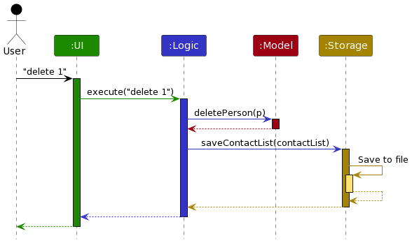 <br>
<b>Fig. 2 - Architecture interactions</b>
</p>

Each of the four main components (also shown in the diagram above),

* defines its *API* in an `interface` with the same name as the Component.
* implements its functionality using a concrete `{Component Name}Manager` class (which follows the corresponding API `interface` mentioned in the previous point.
<div style="page-break-after: always;"></div>
For example, the `Logic` component defines its API in the `Logic.java` interface and implements its functionality using the `LogicManager.java` class which follows the `Logic` interface. Other components interact with a given component through its interface rather than the concrete class (reason: to prevent outside component's being coupled to the implementation of a component), as illustrated in the (partial) class diagram below.

<p align="center">
 <br>
<b>Fig. 3 - Interacting through the API interfaces</b>
</p>

The sections below give more details of each component.
<div style="page-break-after: always;"></div>

### UI component
[<sub><sup>Back to top</sup></sub>](#table-of-contents)

The **API** of this component is specified in [`Ui.java`](https://github.com/AY2122S2-CS2103T-W12-1/tp/blob/master/src/main/java/seedu/address/ui/Ui.java)

<p align="center">
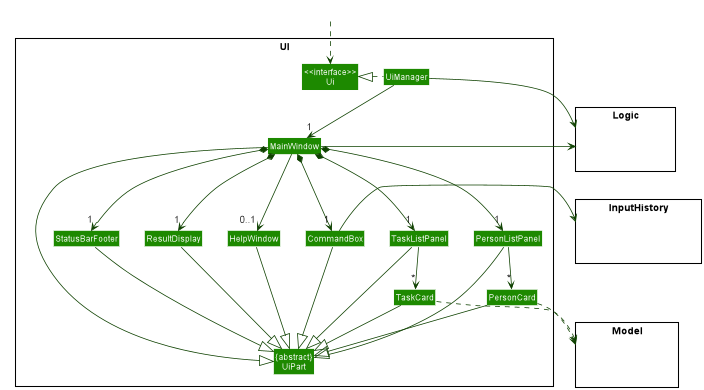 <br>
<b>Fig. 4 - Structure of the UI Component</b>
</p>

The UI consists of a `MainWindow` that is made up of parts e.g.`CommandBox`, `ResultDisplay`, `PersonListPanel`, `StatusBarFooter` etc. All these, including the `MainWindow`, inherit from the abstract `UiPart` class which captures the commonalities between classes that represent parts of the visible GUI.

The `UI` component uses the JavaFx UI framework. The layout of these UI parts are defined in matching `.fxml` files that are in the `src/main/resources/view` folder. For example, the layout of the [`MainWindow`](https://github.com/se-edu/addressbook-level3/tree/master/src/main/java/seedu/address/ui/MainWindow.java) is specified in [`MainWindow.fxml`](https://github.com/se-edu/addressbook-level3/tree/master/src/main/resources/view/MainWindow.fxml)

The `UI` component,

* executes user commands using the `Logic` component.
* listens for changes to `Model` data so that the UI can be updated with the modified data.
* keeps a reference to the `Logic` component, because the `UI` relies on the `Logic` to execute commands.
* depends on some classes in the `Model` component, as it displays `Person` object residing in the `Model`.
* keeps a reference to the `InputHistory` component, because the `CommandBox` relies on it to obtain previously entered commands by the user
<div style="page-break-after: always;"></div>

### Logic component
[<sub><sup>Back to top</sup></sub>](#table-of-contents)

**API** : [`Logic.java`](https://github.com/AY2122S2-CS2103T-W12-1/tp/blob/master/src/main/java/seedu/address/logic/Logic.java)

Here's a (partial) class diagram of the `Logic` component:

<p align="center">
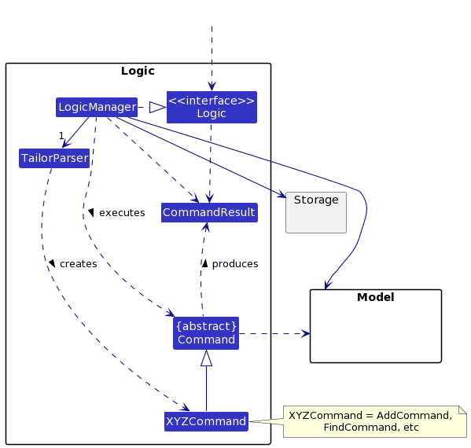 <br>
<b>Fig. 5 - Structure of the Logic Component</b>
</p>

How the `Logic` component works:
1. When `Logic` is called upon to execute a command, it uses the `TailorParser` class to parse the user command.
1. This results in a `Command` object (more precisely, an object of one of its subclasses e.g., `AddCommand`) which is executed by the `LogicManager`.
1. The command can communicate with the `Model` when it is executed (e.g. to add a person).
1. The result of the command execution is encapsulated as a `CommandResult` object which is returned from `Logic`.
<div style="page-break-after: always;"></div>
The Sequence Diagram below illustrates the interactions within the `Logic` component for the `execute("delete 1")` API call.

<p align="center">
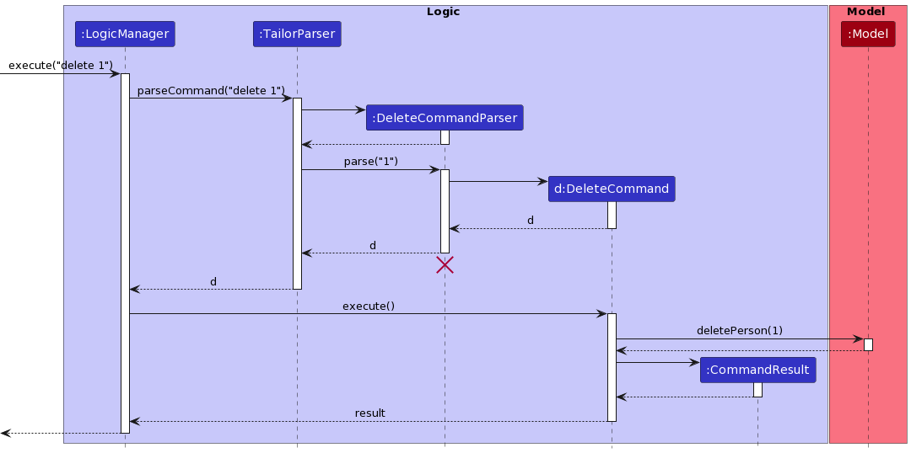 <br>
<b>Fig. 6 - Interactions of a delete command inside the Logic Component</b>
</p>

<div markdown="span" class="alert alert-info">:information_source: **Note:** The lifeline for `DeleteCommandParser` should end at the destroy marker (X) but due to a limitation of PlantUML, the lifeline reaches the end of diagram.
</div>

Here are the other classes in `Logic` (omitted from the class diagram above) that are used for parsing a user command:

<p align="center">
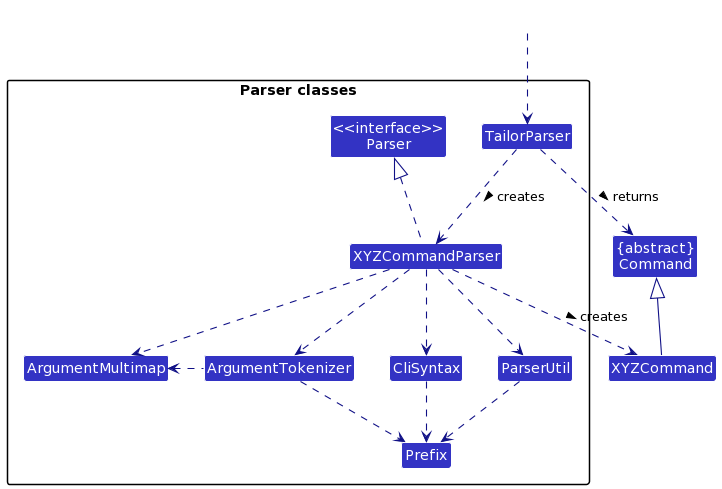 <br>
<b>Fig. 7 - Classes in Logic that are involved in parsing</b>
</p>

How the parsing works:
* When called upon to parse a user command, the `TailorParser` class creates an `XYZCommandParser` (`XYZ` is a placeholder for the specific command name e.g., `AddCommandParser`) which uses the other classes shown above to parse the user command and create a `XYZCommand` object (e.g., `AddCommand`) which the `TailorParser` returns back as a `Command` object.
* All `XYZCommandParser` classes (e.g., `AddCommandParser`, `DeleteCommandParser`, ...) inherit from the `Parser` interface so that they can be treated similarly where possible e.g, during testing.
* The following Figure 8 depicts parsing in action:

<p align="center">
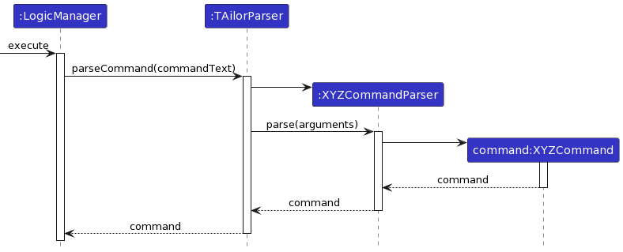 <br>
<b>Fig. 8 - Parsing of commands that take in arguments</b>
</p><div style="page-break-after: always;"></div>

### Model component
[<sub><sup>Back to top</sup></sub>](#table-of-contents)

**API** : [`Model.java`](https://github.com/AY2122S2-CS2103T-W12-1/tp/blob/master/src/main/java/seedu/address/model/Model.java)

<p align="center">
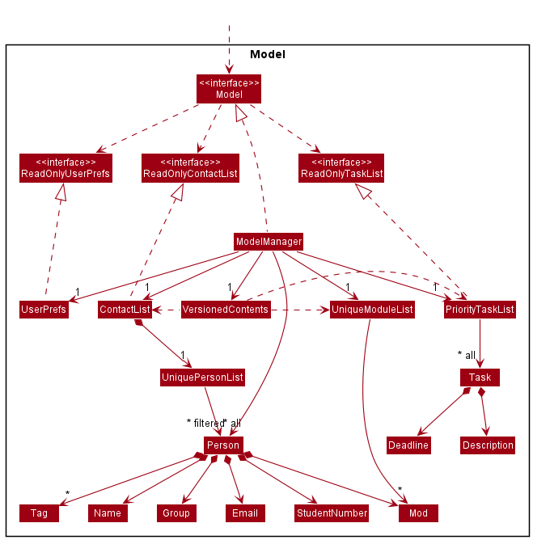 <br>
<b>Fig. 9 - Structure of the Model Component</b>
</p>

The `Model` component,

* stores the content data i.e., all `Person`, `Task` and `Module` objects (which are contained in a `UniquePersonList`, `PriorityTaskList` and `UniqueModuleList` object).
* stores the currently 'selected' `Person` objects (e.g., results of a search query) as a separate _filtered_ list which is exposed to outsiders as an unmodifiable `ObservableList<Person>` that can be 'observed' e.g. the UI can be bound to this list so that the UI automatically updates when the data in the list change.
* stores the task list data i.e., all `Task` objects (which are contained in a `PriorityTaskList` object).
* stores the module list data and its default group mappings (in a `UniqueModuleList` object)
* stores a `VersionedContents` object that stores the previous states of content data (to support `undo`/`redo`)
* stores a `UserPref` object that represents the user’s preferences. This is exposed to the outside as a `ReadOnlyUserPref` objects.
* does not depend on any of the other three components (as the `Model` represents data entities of the domain, they should make sense on their own without depending on other components)

`VersionedContents` stores versions of the `Content` object, which in turn stores a `ContactList`, `PriorityTaskList` and `UniqueModuleList` object. The class diagram for VersionedContents can be found below.

<p align="center">
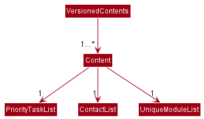 <br>
<b>Fig. 10 - Structure of VersionedContents</b>
</p>

<div markdown="span" class="alert alert-info">:information_source: **Note:** An alternative (arguably, a more OOP) model is given below. It has a `Tag` list in the `ContactList`, which `Person` references. This allows `ContactList` to only require one `Tag` object per unique tag, instead of each `Person` needing their own `Tag` objects. This diagram is also truncated slightly as it does not show the Task classes.<br>

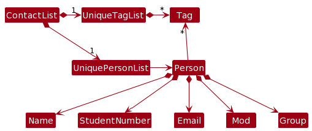 <br>
<b>Fig. 11 - A better Model class diagram</b>

</div>
<div style="page-break-after: always;"></div>

### Storage component
[<sub><sup>Back to top</sup></sub>](#table-of-contents)

**API** : [`Storage.java`](https://github.com/AY2122S2-CS2103T-W12-1/tp/blob/master/src/main/java/seedu/address/storage/Storage.java)

<p align="center">
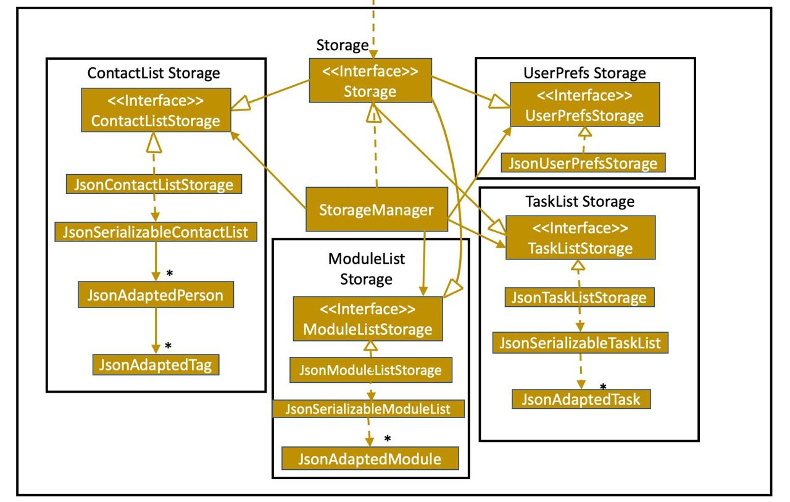 <br>
<b>Fig. 12 - Structure of the Storage component</b>
</p>

The `Storage` component,
* can save contact list data, task list data and user preference data in json format, and read them back into corresponding objects.
* inherits from `ContactListStorage`, `TaskListStorage`, `UserPrefStorage` and `ModuleListStorage`, which means it can be treated as either one (if only the functionality of only one is needed).
* depends on some classes in the `Model` component (because the `Storage` component's job is to save/retrieve objects that belong to the `Model`)
<div style="page-break-after: always;"></div>

### Common classes
[<sub><sup>Back to top</sup></sub>](#table-of-contents)

Classes used by multiple components are in the `seedu.addressbook.commons` package.

Some examples include:

| Class Name | What it is used for                                                            |
|------------|--------------------------------------------------------------------------------|
| CsvUtil    | Checking and parsing CSV files for the import-csv command                      |
| MailUtil   | Launching the system default mail application and checking the input arguments |

--------------------------------------------------------------------------------------------------------------------
<div style="page-break-after: always;"></div>

## **Implementation**
[<sub><sup>Back to top</sup></sub>](#table-of-contents)

This section describes some noteworthy details on how certain features are implemented.

### Task Manager feature
[<sub><sup>Back to top</sup></sub>](#table-of-contents)

#### Implementation

This Task Manager feature is implemented similarly to how commands interact with the XYZManagers and the contact list,
as seen in the [architecture section](#architecture).
Below shows the important classes that were created:

| Logic                   | Model                  | Storage                  | UI            |
|-------------------------|------------------------|--------------------------|---------------|
| NewTaskCommand          | DuplicateTaskException | TaskListStorage          | TaskCard      |
| NewTaskCommandParser    | TaskNotFoundException  | JsonTaskListStorage      | TaskListPanel |
| RemoveTaskCommand       | Description            | JsonSerializableTaskList |               |
| RemoveTaskCommandParser | Deadline               | JsonAdaptedTask          |               |
|                         | Task                   |                          |               |
|                         | ReadOnlyTaskList       |
|                         | PriorityTaskList       |


Most of these classes were linked to the respective XYZManager components.
For example, LogicManager now tries to save to the storage's contact list and task lists:

```
            storage.saveContactList(model.getContactList());
            storage.saveTaskList(model.getTaskList());
```
<div style="page-break-after: always;"></div>
Users also now have 2 additional commands to add new tasks and delete existing tasks, and
the following sequence diagram shows how the new task command works in more detail:

<p align="center">
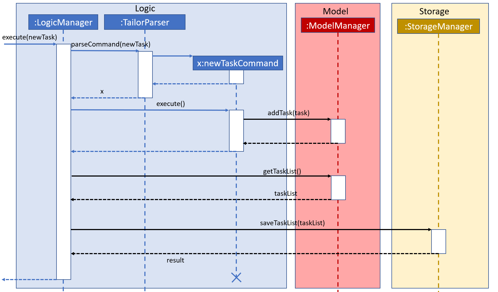 <br>
<b>Fig. 13 - Internal workings of a new task command</b>
</p>

The current Task List uses a manually implemented priority system internally to sort/rank the tasks.

* The tasks are prioritised according to the closeness to the deadline. Ie, a Task with a deadline of
1 March will be in front of another Task with deadline of 1 December of the same year.
* The tasks are compared to each other using the `compareTo` method from the `Comparable` java interface


#### Design Considerations

**Aspect: Extensibility**

* Extensibility was heavily considered when implementing this feature. For Instance,
  * A ReadOnlyTaskList was done instead of just a single TaskList class, to allow for multiple versions of a Task List being
    used if desired. Ie perhaps a Task List that is sorted according to a new "Emergency" level instead of just date-time.
  * Deadline and Description classes were used instead of just a String and a LocalDateTime field to make the codebase more
    consistent with one another as seen from Person and its corresponding fields. This also would then allow a consolidated
    parsing and checking via the utilities.
<div style="page-break-after: always;"></div>
**Aspect: Conformity**

* To allow the entire application to look like it has been coded by one person, the implementation of this task manager
  feature was implemented in a similar way as to how AddressBook/ContactList is implemented, along with its interactions
  with the XYZManagers.
  * An example would be to include a new `TaskListStorage` Interface for the `Storage` Interface to extend from. This
    hence provides the methods and an interface/facade for other parts of the code to perform task list operations on.
  * Another example would be how the Description and Deadlines for a `Task` are represented as individual classes instead
    of a String and a non-wrapped LocalDateTime, respectively. This is similar to how `Person` wraps the individual student
    attributes like Name and Email. This also allows the Description and Deadline objects to be created separately and
    allow for finer control over the codebase.
<div style="page-break-after: always;"></div>

### Undo/redo feature
[<sub><sup>Back to top</sup></sub>](#table-of-contents)

#### Implementation

The undo/redo mechanism is facilitated by `VersionedContents`. It extends `Content` with an undo/redo history, stored internally as an `contentStateList` and `currentStatePointer`. Additionally, it implements the following operations:

* `VersionedContents#commitContent()` — Saves the current content state in its history.
* `VersionedContents#undoContents()` — Restores the previous content state from its history.
* `VersionedContents#redoContents()` — Restores a previously undone content state from its history.

These operations are exposed in the `Model` interface as `Model#commitContent()`, `Model#undoContents()` and `Model#redoContents()` respectively.

Given below is an example usage scenario and how the undo/redo mechanism behaves at each step.

Step 1. The user launches the application for the first time. The `VersionedContents` will be initialized with the initial content state, and the `currentStatePointer` pointing to that single content state.

<p align="center">
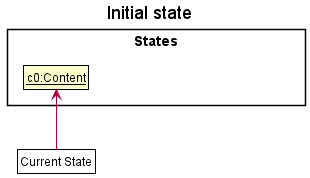 <br>
<b>Fig. 14 - Undo/Redo State 0</b>
</p>

Step 2. The user executes `delete 5` command to delete the 5th student in the contact list. The `delete` command calls `Model#commitContent()`, causing the modified state of the content after the `delete 5` command executes to be saved in the `contentStateList`, and the `currentStatePointer` is shifted to the newly inserted content state.

<p align="center">
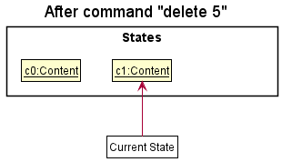 <br>
<b>Fig. 15 - Undo/Redo State 1</b>
</p>

Step 3. The user executes `add n/David …​` to add a new student. The `add` command also calls `Model#commitContent()`, causing another modified content state to be saved into the `contentStateList`.

<p align="center">
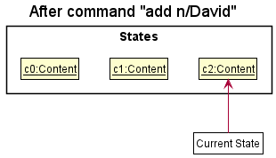 <br>
<b>Fig. 16 - Undo/Redo State 2</b>
</p>

<div markdown="span" class="alert alert-info">:information_source: **Note:** If a command fails its execution, it will not call `Model#commitContent()`, so the content state will not be saved into the `contentStateList`.

</div>

Step 4. The user now decides that adding the student was a mistake, and decides to undo that action by executing the `undo` command. The `undo` command will call `Model#undoContents()`, which will shift the `currentStatePointer` once to the left, pointing it to the previous content state, and restores the content to that state.

<p align="center">
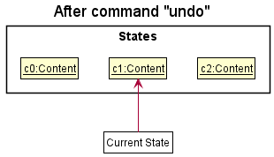 <br>
<b>Fig. 17 - Undo/Redo State 3</b>
</p>

<div markdown="span" class="alert alert-info">:information_source: **Note:** If the `currentStatePointer` is at index 0, pointing to the initial content state, then there are no previous content states to restore. The `undo` command uses `Model#canUndoContent()` to check if this is the case. If so, it will return an error to the user rather
than attempting to perform the undo.

</div>
<div style="page-break-after: always;"></div>
The following sequence diagram shows how the undo operation works:

<p align="center">
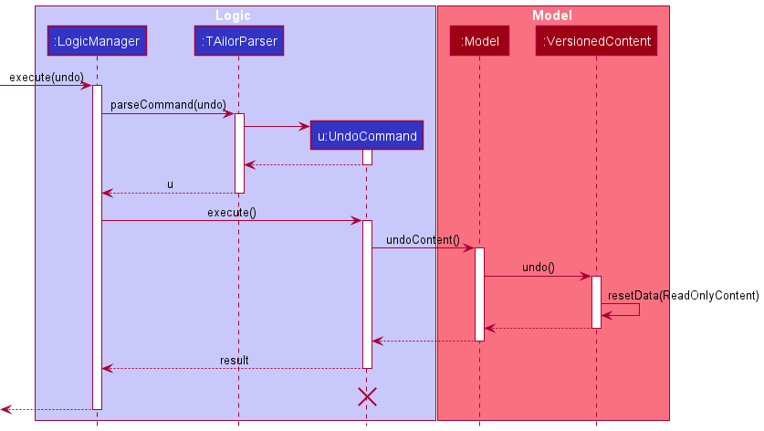 <br>
<b>Fig. 18 - Undo Sequence Diagram</b>
</p>

<div markdown="span" class="alert alert-info">:information_source: **Note:** The lifeline for `UndoCommand` should end at the destroy marker (X) but due to a limitation of PlantUML, the lifeline reaches the end of diagram.

</div>

The `redo` command does the opposite — it calls `Model#redoContents()`, which shifts the `currentStatePointer` once to the right, pointing to the previously undone state, and restores the content to that state.

<div markdown="span" class="alert alert-info">:information_source: **Note:** If the `currentStatePointer` is at index
`contentStateList.size() - 1`, pointing to the latest contact list state, then there are no undone content states to
restore. The `redo` command uses `Model#canRedoContent()` to check if this is the case. If so, it will return an error
to the user rather than attempting to perform the redo.

</div>
<div style="page-break-after: always;"></div>
Step 5. The user then decides to execute the command `list`. Commands that do not modify the content, such as `list`, will usually not call `Model#commitContent()`, `Model#undoContents()` or `Model#redoContents()`. Thus, the `contentStateList` remains unchanged.

<p align="center">
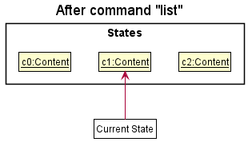 <br>
<b>Fig. 19- Undo/Redo State 4</b>
</p>

Step 6. The user executes `clear`, which calls `Model#commitContent()`. Since the `currentStatePointer` is not pointing at the end of the `contentStateList`, all content states after the `currentStatePointer` will be purged. Reason: It no longer makes sense to redo the `add n/David …​` command. This is the behavior that most modern desktop applications follow.

<p align="center">
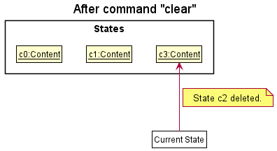 <br>
<b>Fig. 20 - Undo/Redo State 5</b>
</p>
<div style="page-break-after: always;"></div>
The following activity diagram summarizes what happens when a user executes a new command:

<p align="center">
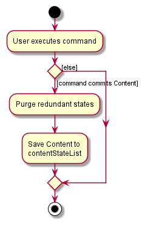 <br>
<b>Fig. 21 - Summary of an execution of a new command</b>
</p>

#### Design considerations:

**Aspect: How undo & redo executes:**

* **Alternative 1 (current choice):** Saves the entire content.
  * Pros: Easy to implement.
  * Cons: May have performance issues in terms of memory usage.

* **Alternative 2:** Individual command knows how to undo/redo by
  itself.
  * Pros: Will use less memory (e.g. for `delete`, just save the student being deleted).
  * Cons: We must ensure that the implementation of each individual command are correct.

We decided to go with alternative 1 as the memory usage expected of TAilor is not high, since users are not expected to
enter many content committing comments. The expected memory usage is not high as well, as the PersonList, TaskList and
ModuleList are generally not space intensive.

Another drawback for alternative 2 was undoing a command by doing its reverse implementation might not return it to the
same state. For example, after `delete 1`, we might save the student just deleted, and set `add "student"` as the `undo`
functionality. However, if we do `add "student"`, the student will be added to the end of the list, which does not exactly
`undo` the effect of the original `delete 1`.
<div style="page-break-after: always;"></div>

### Import CSV feature
[<sub><sup>Back to top</sup></sub>](#table-of-contents)

#### Implementation

The following classes were created in the process of implementing the `import-csv`
command :

| Logic                  | Commons |
|------------------------|---------|
| ImportCsvCommand       | CsvUtil |
| ImportCsvCommandParser |         |

The external library used for reading CSV files is OpenCSV. OpenCSV supports a host of functions that allow one to
manipulate and work with CSV files. The command utilizes the `CSVReader` from the library to read the files.

One important assumption made while implementing the `import-csv` command is that the files are expected to conform to
the format defined by LumiNUS (the learning management system used by NUS). This however, can be modified and extended
to cater to other systems as well.

ImportCsvCommand takes in the path argument for the CSV file, which is parsed to retrieve the contents and load them
into TAilor's database. Exception handling has been done alongside checks (file not found, io, csvvalidation etc)

#### Design Considerations

**Aspect: Motivation**

CSV files are by far one of the most commonly used formats for organizing large
amounts of data in an efficient manner. Since they are plain text files, they are
easier to transfer onto a spreadsheet or another storage database regardless of
the software being used. Since LumiNUS provides a way to import student data from CSV files,
the user would not have to go through the repeated, error-prone process of
manually adding each student's data to the database. `import-csv` automates this process and provides
a one-command solution to this problem.
<div style="page-break-after: always;"></div>
**Aspect: Defensive Coding**

* The import-csv command has been created in a manner that checks for most possible places where the user could go wrong
and provides guidance to correct them through the error messages and the user guide section. 
* This command is designed to be very easy to use for the current target users, which are TAs teaching a NUS module
which implies that they would have manager access on LumiNUS. 
  * The student database exported from LumiNUS conforms exactly to our csv file requirements and hence, any beginner
  user would be able to successfully use this command as long as they follow the directions provided in the user guide.

**Aspect: Usability and Improved User Experience**

* One great feature that the import-csv focuses on is that it adds student contacts from the csv file **additively** to
the student list. Essentially, if some student details already exist in the roster then importing a csv file would not
replace the previous students' data but instead extend the list. 
  * This is extremely useful for TAs who are teaching more than one module and would get different excel files from
  LumiNUS. To prevent increasing administrative requirements on user's end, we will not need them to merge the files
  on their end, instead they can convert their excel sheets to csv and simply import one after the other.
* As such if the user prefers updating their csv locally and importing again then the command handles that situation too
by ignoring duplicate students and simply importing the new updates.
<div style="page-break-after: always;"></div>

### Mailing feature
[<sub><sup>Back to top</sup></sub>](#table-of-contents)

#### Implementation

This Mailing feature enables the user to initiate the system
default mail application (if present). In order to achieve this,
Java AWT (Abstract Window Toolkit) API is used.
Below shows the important classes that were created:

| Logic                  | Util     |
|------------------------|----------|
| MailIndexCommand       | MailUtil |
| MailIndexCommandParser |          |
| MailXCommand           |          |
| MailXCommandParser     |          |
| MailAllCommand         |          |

MailUtil class contains the interaction of TAilor with the desktop mail application. All the commands
call a `launchMail` method in this class to accomplish their respective functionalities.

`mail-index` command allows the user to email a specific student in the contact list based on their index, as displayed
in the application. `mail-x` command enables the user to add multiple prefix-based arguments, using which multiple
students can be mailed in one go. The arguments act as the criteria based on which students are
considered to be a part of the mail group. The mail collation happens based on a descriptor class that takes care of
processing the individual arguments. `mail-all` command is the solution if the user wants to email everyone
in the contact list without any filters. This command allows the user to perform bulk emails.
<div style="page-break-after: always;"></div>
The following is the class diagram for the `MailIndexCommand` class :

<p align="center">
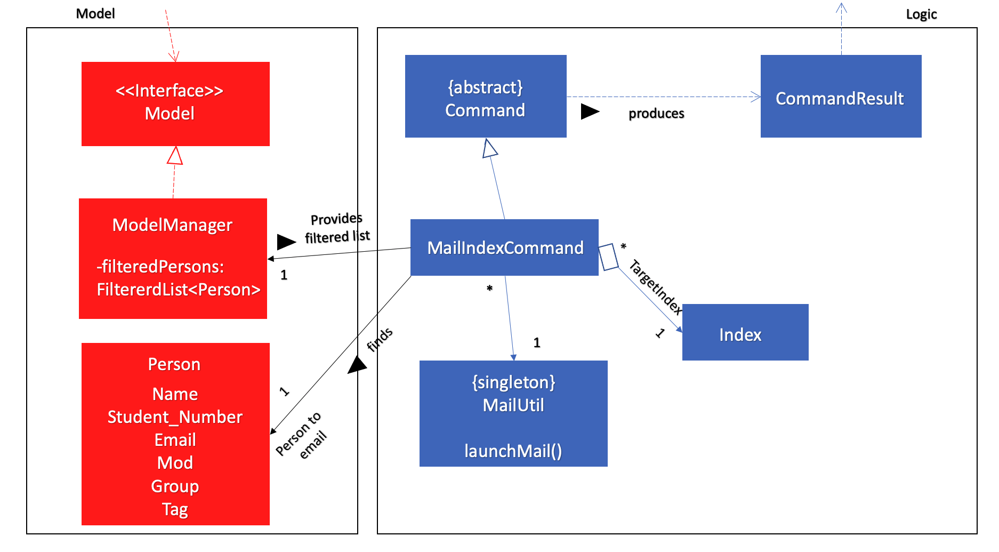 <br>
<b>Fig. 22 - Summary of an execution of a new command</b>
</p>
<div style="page-break-after: always;"></div>
The following sequence diagram shows how the `mail-x` operation works:

<p align="center">
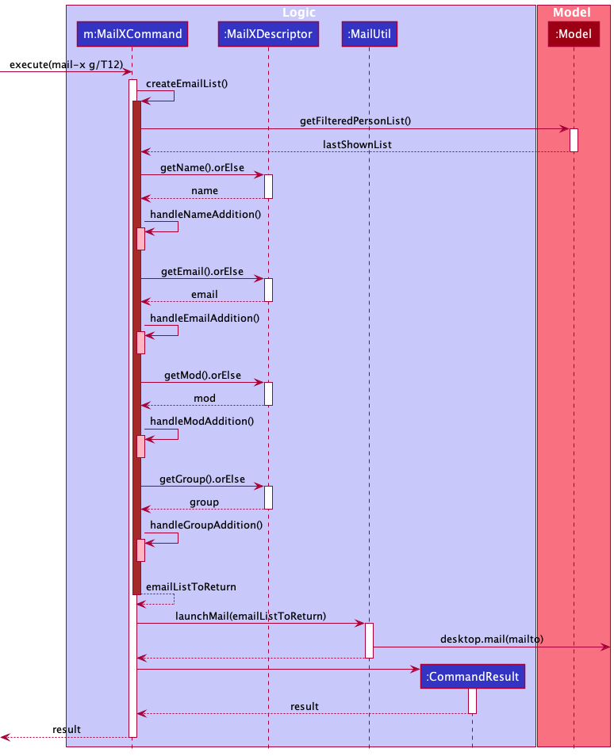 <br>
<b>Fig. 23 - Summary of an execution of a new command</b>
</p>
<div style="page-break-after: always;"></div>
The following sequence diagram shows how the `mail-all` operation works:

<p align="center">
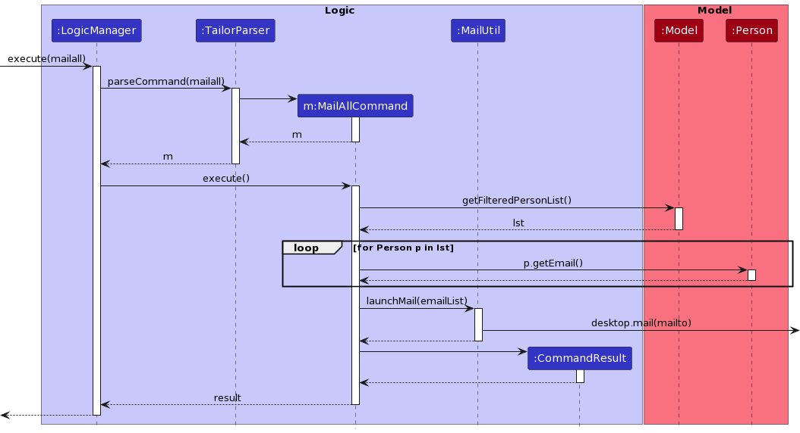 <br>
<b>Fig. 24 - Execution of a `mail-all` command</b>
</p>

#### Design Considerations

**Aspect: Motivation**

This feature forms an integral part of automating communication for the user with the contacts present in the
contact list. Mail commands allow the user to conveniently mail one or more students from the contact list.
The main functionality of all the mail commands is that they would input the receiver's address for the user
in the system default mail application, from where the user can continue on completing the mail on the external
application.

**Aspect: Compatibility**

Mailing feature works across all the popular operating systems. It is able to operate with all mailto compatible
mail applications as long as the default launching application has been set for the system.

**Aspect: Extensibility**

New capabilities for the mailing commands like cc, bcc and subject can be as the arguments without major changes
in the underlying architecture of the product.

**Aspect: Modularity**

Mailing feature comprises well-defined, independent components which leads to better maintainability. All the components
were implemented and tested in isolation before being integrated with the product. An example of this is the `MailUtil`
class, which allows for testing compatibility of the system before integrating with the product to process commands.
<div style="page-break-after: always;"></div>

### Setting a Default Group for a particular Mod
[<sub><sup>Back to top</sup></sub>](#table-of-contents)

#### Implementation
The following classes were created/edited in the process of implementing the `set-default-group` command:


| Logic                   | Model                    | Storage                    |
|-------------------------|--------------------------|----------------------------|
| SetDefaultCommand       | DuplicateModuleException | ModuleListStorage          |
| SetDefaultCommandParser | ModuleNotFoundException  | JsonModuleListStorage      |
|                         | ModuleList               | JsonSerializableModuleList |
|                         | UniqueModuleList         | JsonAdaptedModule          |


The core idea behind this implementation is that there exists an empty `UniqueModuleList` which is a list of `Mod`.
Every Mod object has a `defaultGroup` attribute that initially is unassigned. When a user enters the command `set-default-group m/MOD g/GROUP`, the code:

* Uses `Model#doesModExistInList` to check if the `Mod` exists in `UniqueModuleList`.
* If it exists, get the previous default group using `Model#retrievePrevDefault` and update it.
* Else add the `Mod` to the `UniqueModuleList` with the given default `GROUP` using the `Model#setDefaultGroup` command.

Now when a user adds a new student using the `add` command:
* If the group argument has been passed, the code is run normally
* If the group argument has not been passed, the code retrieves the default group from the `UniqueModuleList` and throws an error if the
given mod has no default group set.

Similar to the TaskList implementation most of these classes are linked to the respective XYZManager components.
For example, LogicManager now tries to save to the storage's moduleList as well:

```
            storage.saveModuleList(model.getModuleList());
```

<div style="page-break-after: always;"></div>
The sequence diagram for the command `set-default-group m/CS2103T g/W12-1` follows the parsing as mentioned in Fig 8.0
above and the specific functioning of the command can be found in the sequence diagram below:

<p align="center">
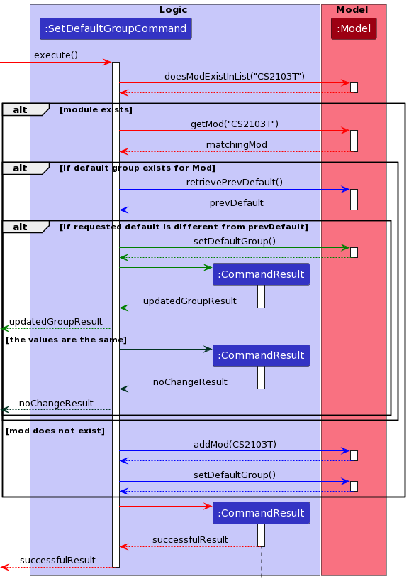 <br>
<b>Fig. 25 - Execution of a `set-default-group` command</b>
</p><div style="page-break-after: always;"></div>

#### Design Considerations

**Aspect: Motivation**

With this feature we aim to help facilitate a better user experience and follow through on TAilor's primary objective of
making administrative tasks less tedious and rudimentary. By setting a default group, the use need not worry
about repeatedly entering the same group value for several students over an extended period of time.

**Aspect: Conformity**

* This feature merges with the functionality of the Add and Edit Commands seamlessly. If the default value has been set,
then the group argument is essentially optional for the users and TAilor will update the student's data to include
the default group value. If a group argument is provided, however, then TAilor prioritises the field provided by the
user over the previously set default group value.

* The implementation of the UniqueModuleList is extremely similar to how the ContactList and TaskList is implemented, with the
interactions with the XYZManagers the same.
  * An example would be to include a new `ModuleListStorage` Interface for the `Storage` Interface to extend from. This
    hence provides the methods and an interface/facade for other parts of the code to perform module list operations on.
<div style="page-break-after: always;"></div>

### Refill previously typed command feature
[<sub><sup>Back to top</sup></sub>](#table-of-contents)

#### Implementation
This feature is facilitated by `InputHistoryManager`. It implements `InputHistory`, and stores the previously entered
user commands internally as a `previousInputs` and `indexPointer`. `InputHistoryManager` also implements:

* `InputHistoryManager#storeInput(input)` — Stores the entered input in the `InputHistoryManager`.
* `InputHistoryManager#getPreviousUserInput()` — Returns the previously entered input.
* `InputHistoryManager#getNextUserInput()` — Returns the next entered input.

Given below is an example usage scenario and how the mechanism behaves at each step.

Step 1. The user launches the application for the first time. The `InputHistory` will be initialized with an empty
`previousInputs`, and the `indexPointer` pointing to `0`. The `CommandBox` is empty upon initialization as well.
<br>

<p align="center">
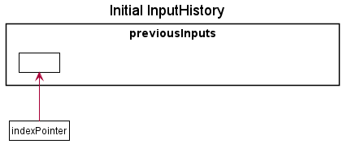 <br>
<b>Fig. 26 - Previous input state 0</b>
</p>

Step 2. The user enters the command `delete 1`. The `CommandBox` will call `storeInput("delete 1")` on `InputHistory`.
The `indexPointer` will increment by 1, pointing to `1`. The `CommandBox` clears itself upon entering the command.
<br>

<p align="center">
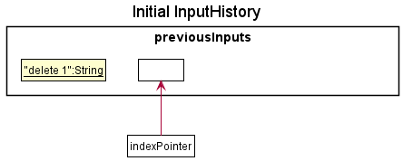 <br>
<b>Fig. 27 - Previous input state 1</b>
</p>

Step 3. The user enters the command `delet 1`. The `CommandBox` will call `storeInput("delet 1")`. The `indexPointer`
will increment by 1, pointing to `2`. However, as the input command is invalid, the `CommandBox` does not clear itself
upon entering the command.
<br>

<p align="center">
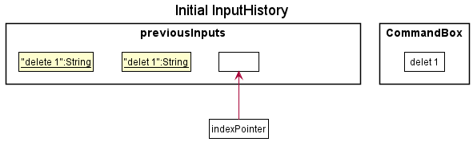 <br>
<b>Fig. 28 - Previous input state 2</b>
</p>

Step 4. When the user presses the &uarr; button, the `CommandBox` will call `getPreviousUserInput()`, which decrements
the pointer by 1, pointing it to `"delet 1"`. The text in `CommandBox` will still remain as "delet 1".
<br>

<p align="center">
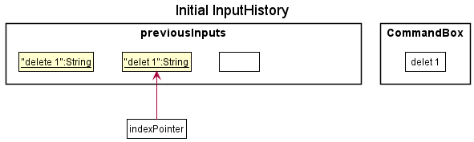 <br>
<b>Fig. 29 - Previous input state 3</b>
</p>

<div markdown="span" class="alert alert-info">:information_source: **Note:** If the `indexPointer` is at index 0, where
`previousInputs` is empty, then there are no previous inputs to refill. The `CommandBox` will call
`InputHistoryManager#canGetPrevInput()` to check if theres any previous inputs. If not, the `CommandBox` will simply not
be updated.

</div>

The following sequence diagram demonstrates how the refill previous input works
<br>

<p align="center">
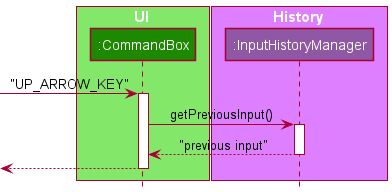 <br>
<b>Fig. 30 - Previous input Sequence Diagram</b>
</p>
<div style="page-break-after: always;"></div>
Step 5. When the user presses the &uarr; button, the `CommandBox` will call `getPreviousUserInput()`, which decrements
the pointer by 1, pointing it to `"delete 1"`. The text in `CommandBox` will change to "delete 1".
<br>

<p align="center">
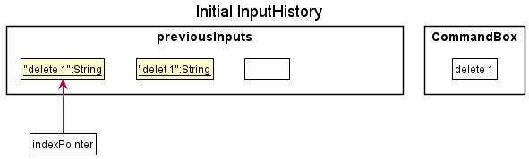 <br>
<b>Fig. 31 - Previous input state 4</b>
</p>

Step 6. When the user presses the &darr; button, the `CommandBox` will call `getNextUserInput()`, which increments the
pointer by 1, pointing it to "delete 1". The text in the `CommandBox` will update to "delete 1".

<p align="center">
 <br>
<b>Fig. 32 - Previous input state 3</b>
</p>


<div markdown="span" class="alert alert-info">:information_source: **Note:** If the `indexPointer` is at index
`previousInputs.size() - 1`, then there are no previous inputs to restore. The `CommandBox` will call
`InputHistoryManager#canGetNextInput()` to check if there's any next inputs. If not, the `CommandBox` will simply not
be updated.

</div>

Finally, the user decides to enter a new command, `undo`. The `CommandBox` will call `storeInput("undo")`. The
`indexPointer` will update to point to `3`. The `CommandBox` clears itself upon entering the command.
<br>

<p align="center">
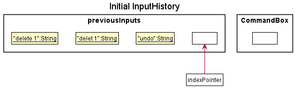 <br>
<b>Fig. 33 - Previous input state 5</b>
</p><div style="page-break-after: always;"></div>

#### Design Considerations

**Aspect: Motivation**

As quick typers, it is inevitable for us to make typos once in a while. In those cases, it is very convenient if we
could quickly refill the `CommandBox` with the mistyped input, and correct the mistake there. This features serves to
meet that need.

**Aspect: Coupling**

To reduce the coupling introduced by this feature as much as possible, the `InputHistoryManager` object only has an
association with the `CommandBox` UI part. As TAilor is designed only with 1 point of input, the `InputHistoryManager`
only needs to be associated with the `CommandBox`.

**Aspect: Extendability**

If the application is expanded to include multiple points of input, each input box can be associated with their own instance
of `InputHistoryManager`, which can allow each of them to store their own input histories.
<div style="page-break-after: always;"></div>

### Getting help
[<sub><sup>Back to top</sup></sub>](#table-of-contents)

#### Implementation

The following classes were created/modified in the process of implementing `help` command :

| Logic             |
|-------------------|
| HelpCommand       |
| HelpCommandParser |

The main idea behind this extension is that the user may request for help on how to use a particular command,
what are the arguments that are accepted by that command, and what is the expected syntax.

There are two main ways in which this command can be used :
* `help` will open a modal with a link to the user guide of the product.
* `help COMMAND_WORD` will output the usage instructions of the `COMMAND_WORD` and a short description as to what
  it does.

Essentially `COMMAND_WORD` is an optional argument to the `help` command which gets parsed using the `HelpCommandParser`.

The following is the sequence diagram of `help` command's execution :

<p align="center">
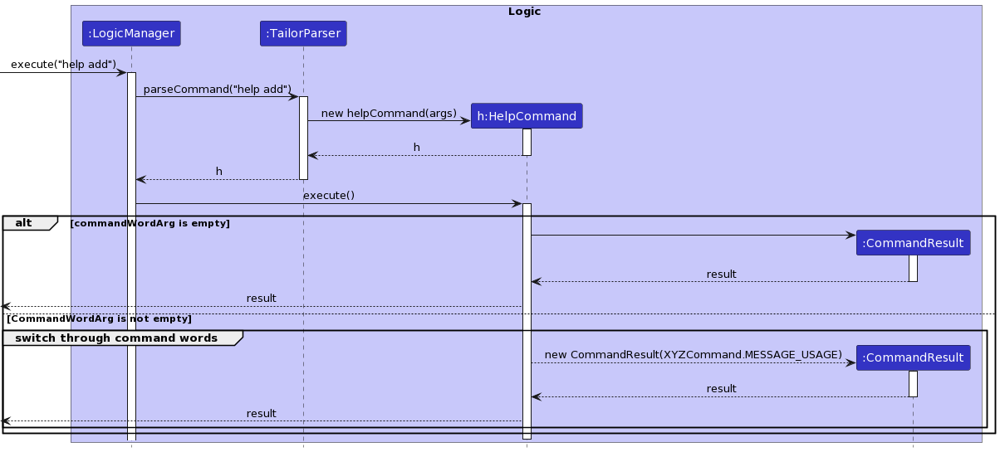
<b>Fig. 34 - Help command execution</b>
</p>

#### Design Considerations

**Aspect: Motivation**

This feature allows the user to access the user guide and check the usage of specific commands. The aim of this
feature is to provide user the convenience to access the usage instructions of a particular command without
referring to the user guide everytime. It forms an extension over the original `help` command.
This feature was inspired from the `--help` flag that is present in most modern day CLI tools.

**Aspect: Maintainability**

`help` command's extension was done in a manner that any new command can be easily incorporated into the
functionality without too many changes. In this way, it is highly maintainable.

**Aspect: Robustness**

`help` command is able to tolerate unpredictable or invalid input. Appropriate exception handling has been done to
ensure that it does not process erroneous input.

--------------------------------------------------------------------------------------------------------------------
<div style="page-break-after: always;"></div>

## **Documentation, logging, testing, configuration, dev-ops**
[<sub><sup>Back to top</sup></sub>](#table-of-contents)

* [Documentation guide](Documentation.md)
* [Testing guide](Testing.md)
* [Logging guide](Logging.md)
* [Configuration guide](Configuration.md)
* [DevOps guide](DevOps.md)

--------------------------------------------------------------------------------------------------------------------
<div style="page-break-after: always;"></div>

## **Appendix: Requirements**
[<sub><sup>Back to top</sup></sub>](#table-of-contents)

### Product scope
[<sub><sup>Back to top</sup></sub>](#table-of-contents)

**Target user profile**:

* is a teaching assistant from the School of Computing
* has a need to manage a significant number of students/contacts
* prefer desktop apps over other types
* can type fast
* prefers typing to mouse interactions
* is reasonably comfortable using CLI apps

**Value proposition**: The app will help to facilitate a Teaching Assistant’s journey for multiple modules, particularly with some tedious administrative tasks.
<div style="page-break-after: always;"></div>

### User stories
[<sub><sup>Back to top</sup></sub>](#table-of-contents)

Priorities: High (must have), Medium (nice to have), Low (unlikely to have)

| Priority        | User                                                 | Function                                                                                                            | Benefit                                                                                                     |
|-----------------|------------------------------------------------------|---------------------------------------------------------------------------------------------------------------------|-------------------------------------------------------------------------------------------------------------|
| priority.High   | As a Teaching Assistant,                             | I am able to see my students’ contact details                                                                       | so that I can more easily communicate messages to them                                                      |
| priority.High   | As a Teaching Assistant,                             | I can send bulk emails to students to remind them of the deadlines or to make general PSAs                          | so that I don’t miss on passing them crucial information                                                    |
| priority.High   | As a Teaching Assistant,                             | I can know the number of students in each of my tutorial classes and their names                                    | This helps me keep track of attendance for each session                                                     |
| priority.High   | As a Teaching Assistant,                             | I can “tag” students with various tags                                                                              | so that I can keep track of who to follow up on, who to check up on more often etc                          |
| priority.High   | As a Teaching Assistant                              | I can manually add new students into my contact list                                                                | so I have alternate methods to add students other than to rely on exporting from a file                     |
| priority.High   | As a Teaching Assistant                              | I can edit my students’ contact details manually                                                                    | so that if they have any changes to their details, I can keep track of it and still be able to contact them |
| priority.High   | As a Teaching Assistant                              | I can delete students from my contact list                                                                          | so I can make changes to my student list                                                                    |
| priority.High   | As a new Teaching Assistant using this app           | I am able to get help on how to use the app                                                                         | so I can learn how to use this program                                                                      |
| priority.High   | As a Teaching Assistant who makes typos often        | I am able to go back to the mistyped command                                                                        | so I can quickly correct spelling errors made                                                               |
| priority.Medium | As a Teaching Assistant,                             | I can see the upcoming deadlines                                                                                    | so I prepare for it or remind students about it                                                             |
| priority.Medium | As a Teaching Assistant,                             | I can keep track of how my students have been performing                                                            | so that I can better help the students who need more help                                                   |
| priority.Medium | As a Teaching Assistant                              | I can see all the groups that I need to mark/supervise                                                              | so that I can track all my students and groups                                                              |
| priority.Medium | As a Teaching Assistant,                             | I can manage consultations with my students with the calender system                                                | so that I can more easily cross-reference my availability with my students                                  |
| priority.Medium | As a Teaching Assistant                              | I can know which student’s performance requires review and attention per assignment                                 | so that I can reach out and offer help possibly in the form of a consultation.                              |
| priority.Medium | As a Teaching Assistant                              | I can group students under different tutorial classes                                                               | so I can personalize messages to individual classes                                                         |
| priority.Medium | As a Teaching Assistant,                             | I can receive anonymous feedback from my students                                                                   | so that I can help my students in a more effective way.                                                     |
| priority.Medium | As a Teaching Assistant                              | I can automatically remind students about deadlines and examinations                                                | so that my students will be reminded about the upcoming deadlines easily                                    |
| priority.Low    | As a Teaching Assistant,                             | I can export the necessary numbers about all students in my class from assignment marks to attendance to a CSV file | so that I can perform a better analysis of the semester on whole                                            |
| priority.Low    | As a Teaching Assistant,                             | I can track student's assignment progress                                                                           | so that I know which student to focus on and give reminders to                                              |
| priority.Low    | As a Teaching Assistant who uses different devices   | I can sync my data over different devices                                                                           | so I can use the app over diff devices                                                                      |
| priority.Low    | As a first time user                                 | I can see sample data                                                                                               | so I can see how the app can be used                                                                        |
| priority.Low    | As a Teaching Assistant for a new class              | I can share an introduction document with my students                                                               | so that they can get to know each other a little bit more before the first session                          |
| priority.Low    | As a Tech-Savvy Teaching Assistant who uses Telegram | I can create a telegram group and invite all students to it                                                         | so I can communicate to my students using telegram                                                          |
| priority.Low    | As a Tech-Savvy Teaching Assistant who uses Discord  | I can create a discord channel and invite all my students to it                                                     | so I can communicate to my students using discord                                                           |
| priority.Low    | As a Teaching Assistant using Coursemology           | I can receive notifications from Coursemology on the application                                                    | so I can quickly respond to my student’s questions and submissions on Coursemology                          |
| priority.Low    | As a Teaching Assistant who is involved in grading   | I can automatically distribute grades to students easily                                                            | so my students will not have to manually wait or check for the grades to be released                        |
| priority.Low    | As a Teaching Assistant who takes makeup tutorials   | I can add students temporarily to a class                                                                           | so that I can have the students in my mailing list temporarily                                              |
| priority.Low    | As a Teaching Assistant during unprecedented times   | I can instantly create Zoom meetings using the Zoom SDK                                                             | so that I can automate my workflow for sending meeting invitations to the group                             |
| priority.Low    | As a Teaching Assistant                              | I can tag students for plagarism                                                                                    | so I can automatically inform my professors about plagiarism cases                                          |
| priority.Low    | As a Teaching Assistant who is involved in grading   | I can see a graph of trends about my students’ performance individually                                             | so I can track the progress and improvement of my students                                                  |
| priority.Low    | As a Teaching Assistant                              | I can create aliases for websites that are commonly used by students                                                | so that my students and I can access commonly visited websites easily                                       |
| priority.Low    | As a Teaching Assistant teaching multiple modules    | I am able to separate the management of the modules                                                                 | so that I can be more organised in my work and teaching                                                     |

<div style="page-break-after: always;"></div>

### Use cases
[<sub><sup>Back to top</sup></sub>](#table-of-contents)

(For all use cases below, the **System** is `TAilor` and the **Actor** is the `user`, unless specified otherwise)

**Use case 1 (UC1): Importing an existing database**

**MSS**

1. User requests to import an existing file
2. TAilor requests for the file location
3. User specifies the file location
4. TAilor uploads the file

    Use case ends.

**Extensions:**

* 4a. User requests to add more students manually (UC2)

    User case ends

**Use case 2 (UC2): Manually adding students**

**MSS**

1. User uses the 'add' command
2. TAilor updates the database with student details

   Use case ends.

**Extensions:**

* 1a. User adds permanent student to the class group
    * 1a1. User uses the permanent tag with student details
    * 1a2. TAilor adds the student contact details to the respective group's database

      Use case ends.


* 1b. User adds temporary student to the class group
    * 1b1. User uses the temporary tag with student details
    * 1b2. TAilor asks for validity of temporary tag
    * 1b3. User enters the lifespan of the entry
    * 1b4. TAilor adds the student contact details to the respective group's database

      Use case ends.

<div style="page-break-after: always;"></div>

**Use case 3 (UC3): Finding a student**

**MSS**

1. User requests to find student through particular keywords
2. TAilor returns contact details of matching student

   Use case ends.

**Extensions:**

* 2a. TAilor doesn't find any matches
  * 2a1. TAilor displays an empty list

    User case ends

* 2b. TAilor finds more than one matching student
  * 2b1. TAilor returns list of matching students
  * 2b2. User enters index to select desired student

    User case ends

<div style="page-break-after: always;"></div>

### Non-Functional Requirements
[<sub><sup>Back to top</sup></sub>](#table-of-contents)

1. Should work on any _mainstream OS_ as long as it has Java `11` or above installed.
2. Should be able to hold up to 1000 students without a noticeable sluggishness in performance for typical usage.
3. Should be able to hold up to 100 tasks without a noticeable sluggishness in performance for typical usage.
4. A user with above average typing speed for regular English text (i.e. not code, not system admin commands) should be able to accomplish most of the tasks faster using commands than using the mouse.
5. The code should be open source.
6. Should not require internet connection.

### Glossary
[<sub><sup>Back to top</sup></sub>](#table-of-contents)

* **Mainstream OS**: Windows, Linux, Unix, OS-X
* **Private contact detail**: A contact detail that is not meant to be shared with others
* **Tutor**: A tutor is a teaching assistant for a particular module in NUS.
* **Module**: The subject being taught by the tutor.
* **Group**: A group of students belonging to a particular module managed under a tutor.

--------------------------------------------------------------------------------------------------------------------
<div style="page-break-after: always;"></div>

## **Appendix: Instructions for manual testing**
[<sub><sup>Back to top</sup></sub>](#table-of-contents)

Given below are instructions to test the app manually.

<div markdown="span" class="alert alert-info">:information_source: **Note:** These instructions only provide a starting point for testers to work on;
testers are expected to do more *exploratory* testing.

</div>

### Launch and shutdown
[<sub><sup>Back to top</sup></sub>](#table-of-contents)

1. Initial launch

   1. Download the jar file and copy into an empty folder
      * Double-click the jar file OR:
      * Open the terminal on your PC and move to the directory where `TAilor.jar` is contained in. Then, run `java -jar TAilor.jar`
      the application. We recommend macOS users to use this method of starting the application to avoid errors.

   4. Expected: Shows the GUI with a set of sample contacts/students and tasks. The window size may not be optimum.

2. Closing the application

    1. Type in `exit` in the input/command box

    2. Press the close button for the application at the top right corner of the window.

3. Saving window preferences

   1. Resize the window to an optimum size. Move the window to a different location. Close the window.

   1. Re-launch the app by double-clicking the jar file.<br>
       Expected: The most recent window size and location is retained.
<div style="page-break-after: always;"></div>

### Adding a student
[<sub><sup>Back to top</sup></sub>](#table-of-contents)

1. Adding a student using the `add` command.

   1. Preqrequisites: User needs to have the details of the following attributes of a student:
      * Name (e.g. Alex)
      * Student Number (e.g. A1234567B)
      * Email (e.g. alex@example.com)
      * Module (e.g. CS2030S)
      * Group (e.g. 10G)

   2. Test case: `add n/Alex a/A0001112B e/alex@example.com m/CS2030S g/10G` when there are already 2 students in the list<br>
      Expected: A new student with name `Alex`, student number `A1234567B`, email `alex@example.com`, module `CS2030S` and group `10G` is added
      to the student list. The index number assigned to `Alex` will be 3, the last pre-existing student + 1.<br>
      Details of the added student will be shown in the feedback box.

   4. Test case: `add n/Bob a/A0001112B e/bob@example.com m/CS2030S g/10G` when there are already 3 students in the list, including Alex above.<br>
      Expected: No new student will be added, as the provided student number already belongs to someone in the list (Alex, from the above test case).
      Error details are shown in the feedback box.

   5. Test case: `add n/Alexis a/A0001113B e/alex@example.com m/CS2030S g/10G` when there are already 3 students in the list, including Alex above.<br>
      Expected: No new student will be added, as the provided email address already belongs to someone in the list (Alex, from the above test case).
      Error details are shown in the feedback box.

   6. Test case: `add a/A0001114B e/charles@example.com m/CS2030S g/10G` without conflicting student number and emails present in the list.<br>
      Expected: No new student will be added, as there is no name provided.
      Error details are shown in the feedback box.

   7. Test case: `add n/Dickson e/dson@example.com m/CS2030S g/10G` without conflicting student number and emails present in the list.<br>
      Expected: No new student will be added, as there is no student number provided.
      Error details are shown in the feedback box.

   8. Test case: `add n/Eliza a/A0001115B m/CS2030S g/10G` without conflicting student number and emails present in the list.<br>
      Expected: No new student will be added, as there is no email address provided.
      Error details are shown in the feedback box.

   9. Test case: `add n/Felicia a/A0001116B e/felicia@example.com g/10G` without conflicting student number and emails present in the list.<br>
      Expected: No new student will be added, as there is no module provided.
      Error details are shown in the feedback box.

   10. Test case: `add n/George a/A0001117B e/george@example.com m/CS2030S` when there is **no** default group set for the module `CS2030S`,
       and without any conflicting student number and emails present in the list.<br>
       Expected: No new student will be added, as there is no group provided.
       Error details are shown in the feedback box.

   11. Test case: `add n/Hector a/A0001118B e/hectorzz@example.com m/CS2030S` when there **is** a default group set for the module `CS2030S`, for example `Group1`.
       Also, there are no conflicting student number and emails present in the list, that currently contains 3 people.<br>
       Expected: A new student with name `Hector`, student number `A0001118B`, email `hectorzz@example.com`, module `CS2030S` and group `Group1` is added
       to the student list. The index number assigned to `Hector` will be 4, the last pre-existing student + 1.<br>
       Details of the added student will be shown in the feedback box.


2. Adding multiple students using the `import-csv` command

   1.  Prerequisites: There needs to exist a csv file at the given path and start with an empty contactlist.

   2. Test case: `import-csv src/test/data/ImportCsvTest/sample-tutorial-data.csv` where there is no other student data.
    Expected: New students are added with the details matching in the sample-tutorial-data.csv.

   3. Test case: `import-csv ./second-sample-tutorial-data.csv` where there is a csv file in your current directory.
    Expected: New students are added with the details matching in the second-sample-tutorial-data.csv. Students with existing names/matric numbers are skipped.
<div style="page-break-after: always;"></div>

### Editing a student
[<sub><sup>Back to top</sup></sub>](#table-of-contents)

1. Editing an existing student in the student list.

   1. Prerequisites: List all students using the `list` command. Multiple students in the list.

   2. Test case: `edit 1 n/Bob` when the first student in the list has a name of `Alex`.<br>
      Expected: The name of the first student is edited, from `Alex` to `Bob`. Details of the edit are shown in the feedback message.

   3. Test case: `edit 0 n/Bob`<br>
      Expected: No student is edited. Error details shown in the status message.

   4. Other incorrect delete commands to try: `edit`, `edit x`, `...` (where x is larger than the list size)<br>
      Expected: Similar to previous.

   5. Test case: `edit 1` with at least 1 student in the list.<br>
      Expected: Similar to previous, as there are no arguments specified to be edited
<div style="page-break-after: always;"></div>

### Deleting a student
[<sub><sup>Back to top</sup></sub>](#table-of-contents)

1. Deleting a student while all students are being shown.

   1. Prerequisites: List all students using the `list` command. Multiple students in the list.

   1. Test case: `delete 1`<br>
      Expected: First student is deleted from the list. Details of the deleted student shown in the feedback message.

   1. Test case: `delete 0`<br>
      Expected: No student is deleted. Error details shown in the status message.

   1. Other incorrect delete commands to try: `delete`, `delete x`, `...` (where x is larger than the list size)<br>
      Expected: Similar to previous.

2. Deleting a student while only some students are shown.

   1. Prerequisites: Find some students using the `find` command. Multiple students in the list, depending on the result of the `find` command.

   2. Test case: `delete 1`<br>
      Expected: First student is deleted from the list. Details of the deleted student shown in the feedback message. Performing a `list` command will also show that the deleted student is no longer in the list.

   3. Test case: `delete 0`, `delete`, `delete x`, `...` <br>
      Expected: Similar to the erroneous test cases from the list command above.
<div style="page-break-after: always;"></div>

### Mailing student(s)
[<sub><sup>Back to top</sup></sub>](#table-of-contents)

1. Mailing an individual student from the contact list

   1. Prerequisites: Multiple students in the contact list.

   2. Test case: `mail-index 1`<br>
      Expected: System default mail application opens up with the receiver's field filled with the email address of
      the student at the specified index ie 1.

   3. Test case: `mail-index 2`<br>
         Expected: System default mail application opens up with the receiver's field filled with the email address of
         the student at the specified index ie 2.

2. Mailing all the students in a particular module
   1. Prerequisites: Multiple students in the contact list belonging to the module CS2103 (example scenario).

   2. Test case: `mail-x m/CS2103`<br>
      Expected: System default mail application opens up with the receiver's field filled with the email addresses of
      all the students belonging to CS2103 module in the contact list.

3. Mailing everyone in the contact list

   1. Prerequisites: Multiple students in the contact list.

   2. Test case: `mail-all`<br>
      Expected: System default mail application opens up with the receiver's field filled all the email addresses of
      students in the entire contact list.
<div style="page-break-after: always;"></div>

### Creating a Task
[<sub><sup>Back to top</sup></sub>](#table-of-contents)

1. Creating a new task to keep track of.

   1. Prerequisites: Brief description and deadline of the task should be known.

   2. Test case: `newtask Do Homework by/2022-01-03T16:30` when there are already 2 tasks in the task list.<br>
      Expected: A new task with description `Do Homework` and deadline of 3 January 2022, 4:30pm will be added to the task list.
      The index number assigned to this task will be 3, the last pre-existing task + 1.<br>
      Details of the added task will be shown in the feedback box.

   3. Test case: `newtask Mark Tutorial`<br>
      Expected: No task is added as no deadline is provided. Error details shown in the status message.

   4. Test case: `newtask by/2022-02-04T17:29`<br>
      Expected: No task is added as no description is provided. Error details shown in the status message.

   5. Test case: `newtask Mark Lab 1 by/2022-02-04 17:29`<br>
      Expected: No task is added as the provided date format is incorrect. Error details shown in the status message.

   6. Test case: `newtask Mark Lab 1 by/2022-02-29T17:29`<br>
      Expected: No task is added as 2022 is not a leap year, and has no Feb 29. Error details shown in the status message.
<div style="page-break-after: always;"></div>

### Deleting a Task
[<sub><sup>Back to top</sup></sub>](#table-of-contents)

1. Deleting a task from the task list.

    1. Prerequisites: Multiple tasks in the task list.

    2. Test case: `del-task 1`<br>
       Expected: First task is deleted from the list. Details of the deleted task shown in the feedback message.

    3. Test case: `del-task 0`<br>
       Expected: No task is deleted. Error details shown in the status message.

    4. Other incorrect delete task commands to try: `del-task`, `del-task x`, `...` (where x is larger than the list size)<br>
       Expected: Similar to previous.
<div style="page-break-after: always;"></div>

### Undoing/Redoing commands
[<sub><sup>Back to top</sup></sub>](#table-of-contents)

1. Undoing a command

   1. Prerequisites: There must be an undo-able command executed beforehand in the same usage session.

   2. Test case: `undo` and the previous command added a new student (`add` command)<br>
      Expected: The add command is undone, and the new student no longer appears in the student list. Feedback is shown in the feedback box
      that the undo command has been done.

   3. Test case: `undo` and the only previous commands are `list` or `find` commands<br>
      Expected: No undo-able command is available. Nothing changes, and an error pops up indicating that there is nothing to undo.

   4. Test case: `undo` and there are no commands done yet since launching the application<br>
      Expected: Same as above.

3. Redoing a command

   1. Similar to the undo command, flipping `undo` into `redo`, before into after.
<div style="page-break-after: always;"></div>

### Getting help
[<sub><sup>Back to top</sup></sub>](#table-of-contents)

1. Getting help through user guide

   1. Prerequisites: None

   2. Test case: `help`<br>
      Expected : A popup opens with a link to the user guide of the application.

2. Getting help about a specific command

   1. Prerequisites : None

   2. Test case: `help add-task`<br>
      Expected : The usage instructions of the `add-task` command are displayed.


### Saving data
[<sub><sup>Back to top</sup></sub>](#table-of-contents)

1. Dealing with missing/corrupted data files (contactlist.json, tasklist.json, modulelist.json)

   1. Missing/corrupted data can occur from some ways listed below: (non-exhaustive!)
      * The .json files have been tampered with, intentionally or not.
      * The .json files cannot be read by TAilor upon startup.

   2. Currently, TAilor does not have any in-built back up system. As such, we recommend users to do manual back ups
      once in a while, to ensure that everything is saved at a restore point.

   3. Additionally, if users decide to modify the .json files manually to add in new data, it is also recommended for them
      to make a backup copy of the data files before doing so.

   4. In the case of unfortunate events where the user did not make a back up and data is indeed lost, the user has no choice
      but to manually enter in the data again from scratch.

2. TAilor should save to the 3 data files automatically, upon the execution of most commands. As such, there is no need to perform a "save"
   command to ensure that the data files are updated.
