## Table of Contents
* Table of Contents
{:toc}

## **Introduction**
[Back to top](#table-of-contents)

TAilor is a **desktop app for managing contacts, optimized for use via a Command Line Interface (CLI)**
while still having the benefits of a Graphical User Interface (GUI). If you belong to the home faculty of the School of
Computing, are a Teaching Assistant in NUS and can type fast, TAilor can get tedious contact management tasks done
faster than traditional GUI apps!

### Things to note before you begin

* Currently, TAilor supports only typical modules offered to students from NUS, such as MA1101R and GER1000.
* There is no support for DYOM modules at the moment as they do not conform to module naming conventions followed by most NUS
faculties.
* There is only support for students whose home university is NUS currently as well, so their matriculation
numbers should be in the form of "A0123456X" as according to NUS. This is essentially a 7-digit number preceded by a
capital letter "A" and followed by another concluding capital letter.
* This application has mail commands that use your system's default mail application. If none was found or set, your
computer will prompt you for an application to use. To use your preferred mail app, please ensure that the specified
app is set as the default in your computer settings.

If the intended usage above does not fit you, don't worry, you still can use our application. The only downside is that features
may seem a little odd to you, or you may need to do some manual adjustments. Fret not, we are currently working to produce a
version of TAilor that can be used by a wider range of users, so stay tuned!

--- 

## **Quick start**
[Back to top](#table-of-contents)

 :exclamation: **Caution:**
If you are a Mac User, it may be possible that some incompatibilities may surface in the form of garbled/unreadable
text in the GUI. It is advised to switch to Azul build of OpenJDK 11 to solve this issue.
Please refer to this <a href="https://nus-cs2103-ay2122s2.github.io/website/admin/programmingLanguages.html#programming-language">link</a>
for more information.

1. Ensure you have **Java 11** or above installed in your Computer. A link to download Java is provided [here.](https://openjdk.java.net/projects/jdk/11/)

2. Download the latest `TAilor.jar` from [here](https://github.com/AY2122S2-CS2103T-W12-1/tp/releases).

3. Move the .jar file to the folder you want to use as the _home folder_ for your TAilor Application.

4. There are two ways to start TAilor:
   1. Open the terminal on your PC and move to the directory where `TAilor.jar` is contained in. Then, run `java -jar TAilor.jar`
      the application. We recommend macOS users to use this method of starting the application to avoid errors.
   2. Double-click the .jar file to start the app.  
      The GUI similar to the one below should appear in a few seconds. Note
      how the app contains some sample data. 
      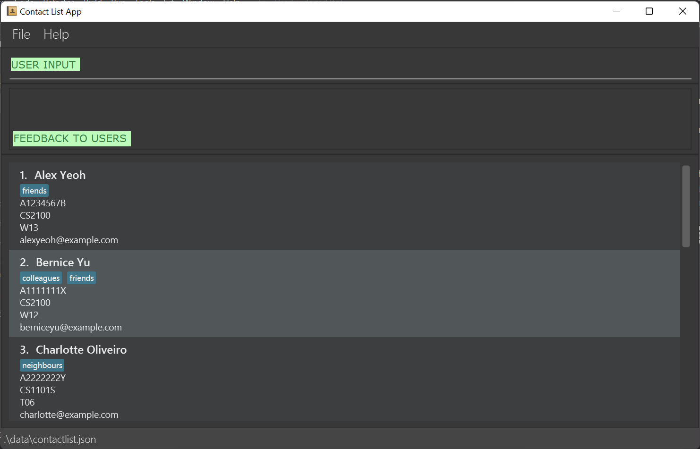  

5. Type a command into the command box and press **&#9166; Enter** to execute it. e.g. typing **`help`** and pressing **&#9166; Enter**
   will open the help window. 
   Some example commands you can try:

    * `list` : Lists all contacts.

    * `add n/John Doe a/A0123456P e/johnd@example.com m/CS2103T g/W12` : Adds a student

    * `delete 3` : Deletes the 3rd student shown in the current student list.

    * `clear` : Deletes all students in the student list.

    * `exit` : Exits the app.

6. Refer to the [Commands and Features](#commands-and-features) below for details of each command.

### Understanding TAilor's GUI
[Back to top](#table-of-contents)

As seen in the above picture, there are several components of notice for TAilor:

* Command/Input box
* Feedback box
* Student List
* Task List

The following sections will guide you through them one by one:

#### Command/Input box and Feedback box

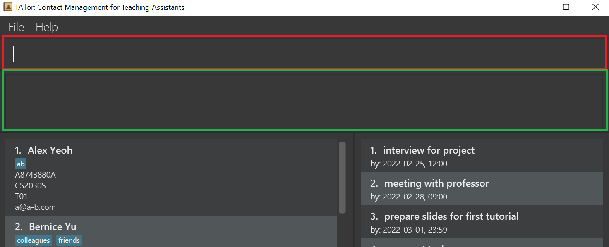

In **red**, is the command/input box for you to enter in your commands. Simply click on the box and type away!

In **green**, is the feedback box given for your command.

An invalid or wrong command entered will display some error messages for you:
 

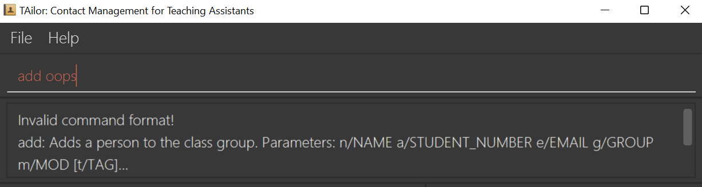

 

A correct command will produce feedback to you about what has been done. In this case, the command `delete 3` was done:
 

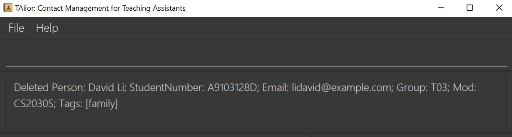

 

#### Student List

This is where you can see the students that are currently added into the application.

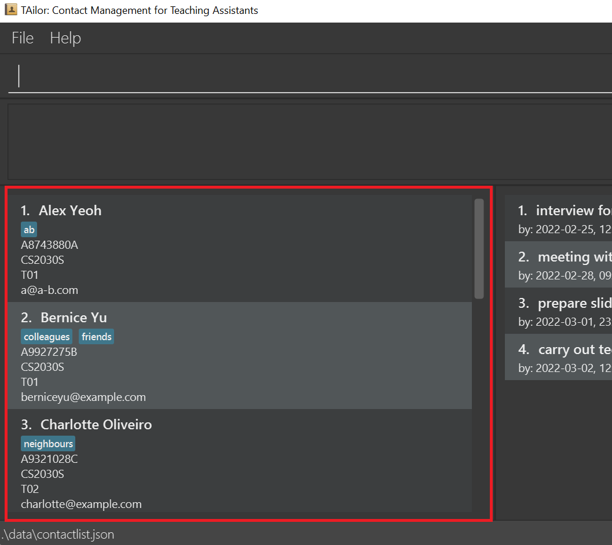

 
Let's take a closer look at one of the entries in the list:

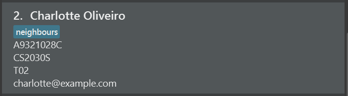

Shown here is:

| Description                                     | From picture above    |
|-------------------------------------------------|-----------------------|
| **Index** of the student in the student list    | Index of 2            |
| **Name** of the student                         | Charlotte Oliveiro    |
| **Tags** given to the student                   | One tag, `PGPR`       |
| **Matriculation/Student number** of the student | A0932133C             |
| **Module** that the student is taking           | CS2030S               |
| **Group** that the student is under             | T02                   |
| **Email** of the student                        | charlotte@example.com |

Note that the group of the student can be set to anything you want, so the meaning of it is derived upon
your own usage. The example given, `T02`, is intended to imply that the student belongs to Tutorial Group 2.

You can choose to follow module conventions for the naming of the groups or make groupings of your own.
Some additional examples are shown below:

* CS2103T groups can be `W12-1` to represent the Wednesday 12PM time slot, group 1.
* CS2101 groups can be `G02` to represent sectional class #2 according to the conventions followed by the module in EduRec/NUSmods
* If you are handling only one group, a simple description like `lab` or `tutorial` can suffice.

   

#### Task List

This is where you can see the tasks you have created.

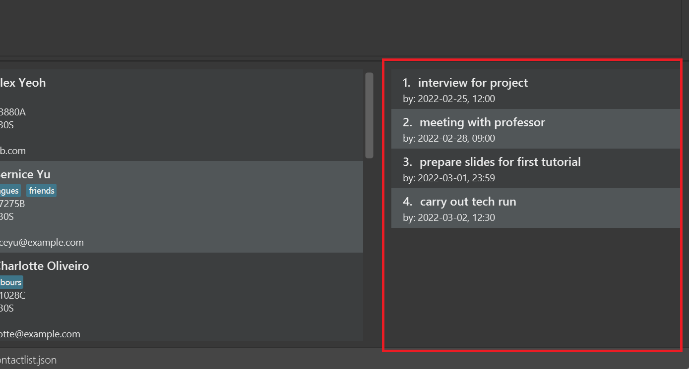

Taking a closer look at one of them:

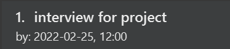

Shown here is:

| Description                                     | From picture above    |
|-------------------------------------------------|-----------------------|
| **Index** of the task in the task list          | Index of 1            |
| **Description** of the task                     | interview for project |
| **Deadline** of the task                        | 2022-02-25, 12:00     |

---

## **Typical usage workflow**
[Back to top](#table-of-contents)

The typical usage for a Teaching Assistant is provided as follows:

1. Launch the application from the steps given in [quick start](#quick-start)

2. Add students to the student list via the [add command](#adding-a-student-add) or the [import command](#adding-students-from-a-csv-file-import-csv).
   * Edit students, if necessary, via the [edit command](#editing-a-student--edit).

3. Perform any of the actions below whenever necessary:
   * Find students via the [find command](#locating-students-find).
   * Mail students via the [various mail commands](#mail-commands).
   * Manage tasks for yourself via the [new task](#adding-a-new-task-newtask) and [delete task](#deleting-an-existing-task-deltask) commands.

4. Repeat steps 2 and 3 whenever necessary.

5. Exit the application via the [exit command](#exiting-tailor-exit) or by pressing the close button for the application.

---

## **Commands and features**
[Back to top](#table-of-contents)

**:information_source: Notes about the command format:** 

* Words in `UPPER_CASE` are the parameters to be supplied by the user. 
  e.g. in `add n/NAME`, `NAME` is a parameter which can be used as `add n/John Doe`.

* Items in square brackets are optional. 
  e.g `n/NAME [t/TAG]` can be used as `n/John Doe t/consultation` or as `n/John Doe`.

* Items with `…`​ after them can be used multiple times including zero times. 
  e.g. `[t/TAG]…​` can be used as ` ` (i.e. 0 times), `t/dropped`, `t/makeup t/consultation` etc.

* Prefix-based arguments can be in any order. 
  e.g. if the command specifies `n/NAME a/STUDENT_NUMBER`, `a/STUDENT_NUMBER n/NAME` is also acceptable. 

* Index arguments must be before all prefix-based arguments. 
  e.g. if the command specifies `INDEX n/NAME`, `n/NAME INDEX` is not acceptable, as `INDEX` must be before all prefix-based arguments.

* If a parameter is expected only once in the command but you specified it multiple times, only the last occurrence of the parameter will be taken. 
  e.g. if you specify `a/A0123456H a/A1111111H`, only `a/A1111111H` will be taken.

* Extraneous parameters for commands that do not take in parameters (such as `list`, `exit` and `clear`) will be ignored. 
  e.g. if the command specifies `list 123`, it will be interpreted as `list`.

* Refer to our [prefix usage table](#prefix-usage-table) for more details on the requirements for each prefix.

* Additionally, TAilor only supports a single command being executed at any one time. There is no support for executing multiple commands.

* Example : `edit 1 n/Bob delete 2`, inputs like these result in unintended behavior as it specifies more than one command, `edit` and `delete`.

* To avoid these unintended behaviors, only enter in one command at a time before pressing **&#9166; Enter**.

### Common commands
[Back to top](#table-of-contents)

#### Viewing help : `help`

Shows a popup message explaining how to access the help page.

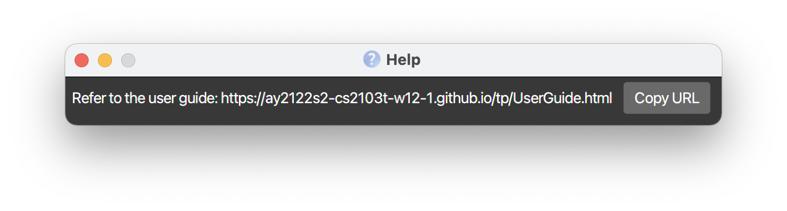

Format: `help [COMMAND_WORD]`

`help` command can be used to show either the link to the user guide or
usage instructions for specific commands.

Examples :
* `help` will show the popup message as shown above.
* `help undo` will show the usage instructions for the `undo` command.
* `help mail-x` will show the usage instructions for the `mail-x` command.

#### Listing all students : `list`

Shows a list of all students in the student list.

Format: `list`

#### Adding a student: `add`

Adds a student to the student list.

Format:
* `add n/NAME a/STUDENT_NUMBER e/EMAIL m/MOD g/GROUP [t/TAG]…​` or
* `add n/NAME a/STUDENT_NUMBER e/EMAIL m/MOD [g/GROUP] [t/TAG]…​` if there is already a default group for the mod.

:bulb: **Tip:**
If the entered student name has more than 50 characters, the entire name may not be displayed. A recommended usage
is to use initials instead.  A student can also have any number of tags (including 0).

Note:
* Only non-duplicate students can be added. Ie, we cannot add duplicate students into the student list.
* Students are considered to be "duplicate" when two students have the same email address or student number.

Examples:

* `add n/John Doe a/A1234567L e/johnd@example.com m/CS2030S g/B12G`
* `add n/Betsy t/friend e/btsy@example.com m/CS2100 g/T1 a/a0123456x t/needshelp`

#### Adding students from a CSV file: `import-csv`

Adds multiple students by importing a Comma Separated Values (CSV) file. This forgoes the hassle of adding students one by
one with the `add` command above.

Format: `import-csv PATH-TO-FILE`

To prepare your CSV files, follow the instructions below:

:bulb: **Note:**
The following steps assume that you, the user, will be having manager access for the Module on LumiNUS and thus will be
able to export the needed Excel sheets as directed. If you do not have that level of access, fret not! You can follow
the requirements below and look at our sample csv file
[here](https://github.com/AY2122S2-CS2103T-W12-1/tp/blob/master/src/test/data/ImportCsvTest/second-sample-tutorial-data.csv) to create your own file from scratch and you're good to go!

1. Export your student list from LumiNUS Classes and Groups.
   * When choosing the format of the file, select and export the following headers:
     * Name,
     * Student Number,
     * Email, and
     * Group
2. Once exported, convert the file to a CSV file. This can be done using any modern spreadsheet software, and must be done
carefully. If you are using Microsoft Office, this [link](https://support.microsoft.com/en-us/office/save-a-workbook-to-text-format-txt-or-csv-3e9a9d6c-70da-4255-aa28-fcacf1f081e6)
may be helpful for guidance.
3. Copy the file's path and import the file into TAilor with the above command! Your file path can be an **absolute** or
   a **relative path** - it doesn't matter as long as it is valid.

:exclamation: **Note:**
The file format, including choice of headers, must be adhered to for the command to work. Excel sheets downloaded from
LumiNUS have 2 additional rows preceding the row containing the column headers that are included in the required CSV format.
Hence, if you were to create your own CSV file, these additional rows are required as well. 
A sample csv file can be found [here](https://github.com/AY2122S2-CS2103T-W12-1/tp/blob/master/src/test/data/ImportCsvTest/second-sample-tutorial-data.csv).
As such, be careful not to corrupt your csv file before importing to TAilor - something that can result from writing
anything or adding information that does not abide by the expected format in the file.

#### Editing a student : `edit`

Edits the details of an existing student in the student list.

Format: `edit INDEX [n/NAME] [a/STUDENT_NUMBER] [e/EMAIL] [m/MOD] [g/GROUP] [t/TAG]…​`

* Edits the student at the specified `INDEX`. This index refers to the index number shown in the displayed student list. 
* The index **must be a positive integer** (1, 2, 3, …​) and should be any one of the indexes displayed. Negative examples include:
    * `edit 0` produces an error, as 0 is not a positive integer
    * `edit 100` for a student list with less than 100 students, will produce an error as there is no 100th student

* At least one of the optional fields must be provided.
* Existing values will be updated to the input values.
* When editing tags, the existing tags of the student will be removed i.e adding of tags is not cumulative.
* You can remove all the student’s tags by typing `t/` without specifying any tags after it.

Examples:
*  `edit 1 a/A1122334X e/johndoe@example.com` Edits the student number and email address of the 1st student to be
   `A1122334X` and `johndoe@example.com` respectively.
*  `edit 2 n/Betsy Crower t/` Edits the name of the 2nd student to be `Betsy Crower` and clears all existing tags.

#### Deleting a student : `delete`

Deletes the specified student from the student list.

Format: `delete INDEX`

* Deletes the student at the specified `INDEX`. This index refers to the index number shown in the displayed student list.
* The index **must be a positive integer** (1, 2, 3, …​) and should be one of the indexes displayed. Negative examples include:
    * `delete 0` produces an error, as 0 is not a positive integer
    * `delete 100` for a student list with less than 100 students, will produce an error as there is no 100th student

Examples:
* `list` followed by `delete 2` deletes the 2nd student in the student list.
* `find n/Betsy` followed by `delete 1` deletes the 1st student in the results of the `find` command.

#### Setting a default group for a mod: `set-default-group`

Sets a default group for a particular module. This replaces the previous default group, and helps reduce redundancies when
adding a student using the `add` command.

Format: `set-default-group m/MOD g/GROUP`

* `MOD` may or may not be an existing mod in TAilor's local database
* `GROUP` can be set any number of times for the same Mod. If a default group value is already set, the new group value
will simply replace it as default.

Examples:
* `set-default-group m/CS2101 g/G02` 

  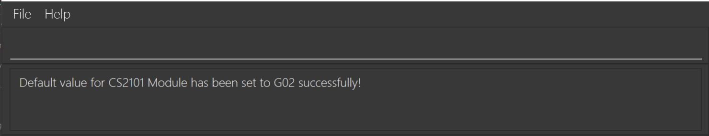

* followed by `set-default-group m/CS2101 g/G02-MonThur4-6` 

  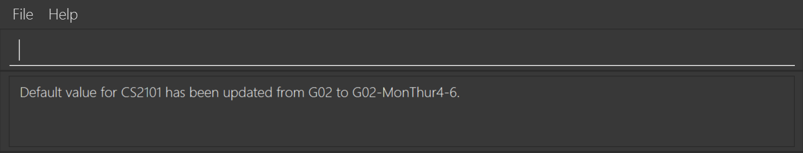

#### Locating students: `find`

Finds students whose details matches **all** of the search parameters.

Format: `find PREFIX/KEYWORD [MORE_KEYWORDS]…​    [PREFIX/KEYWORD [MORE_KEYWORDS]…​]…​`

:bulb: **Tip:**
The format may seem daunting, but remember that everything in `[]` are optional!

A simple find command can be in the form of `find n/alex`. Try it out!

* The [prefixes](#prefix-usage-table) used are the same as other commands:

| Prefix | What it stands for |
|--------|--------------------|
| n/     | Name               |
| a/     | Student Number     |
| e/     | Email              |
| m/     | Module             |
| g/     | Group              |
| t/     | Tags               |

Note:
* Multiple keywords can be given for each prefix.
* The order of the keywords does not matter. e.g. `Hans Bo` will match `Bo Hans`
* The search is case-insensitive. e.g `hans` will match `Hans`
* Keywords **cannot be empty**. e.g. `find n/` will return an error
* Only the specified prefixes will be searched

* For names and tags, **only full words** will be matched e.g. `n/Han` will not match `Hans`
* For the rest, **partial words** will be matched e.g. `e/exam` will match `abc@example.com`

* If multiple **keywords** are specified for a single prefix, students matching **at least one** keyword will be returned
e.g. `n/Hans Bo` will return `Hans Gruber`, `Bo Yang`
* If multiple **prefixes** are specified, students matching **all** prefixes will be returned.

Example:

Let the initial state of the list contain these 3 students: Alex, Bernice, Charlotte.

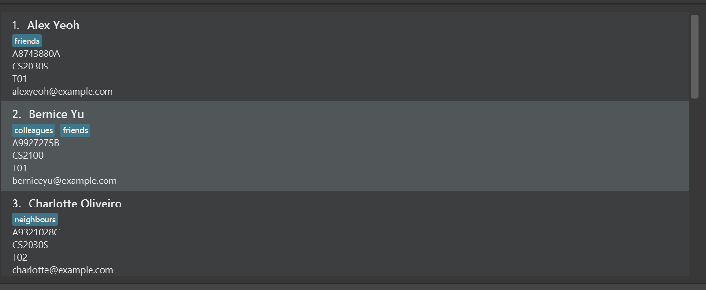

* `find n/alex bernice` returns `Alex` and `Bernice`, because `Alex` and `Bernice` fit into the search arguments for the prefix `name`.
  

* `find n/alex charlotte m/CS g/t01` returns `Alex`, because:
    * `Alex` and `Charlotte` fit within the search arguments for the prefix `name` and `module`,
    * However, only `Alex` has a group of `T01`.
    * Hence, only `Alex` meets the search requirements of **all** search prefixes provided, and is shown.
  
  

#### Undo or Redo a previous command : `undo/redo`

Undoes or redoes a previously entered command that changed a student, task or module.

Format: `undo` or `redo`

* undo can only undo the effects of an add, delete, edit, clear, newtask, deltask, set-default-group and import-csv commands.
* Once you undo and enter a new add, delete, edit, clear, newtask, deltask,  set-default-group and import-csv command, the state that was undone will not be accessible via redo anymore.
* Note the `undo` command will **not** be able to undo the effects of TAilor clearing all of its data caused by incorrect manual editing of data while the app is closed.

Example:

Let the initial state of the list contain these 4 students: Alex, Bernice, Charlotte and David. 

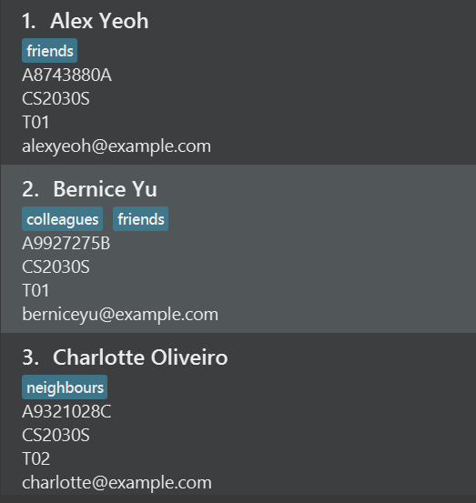

After `delete 1`, we will delete Alex and the list will not have Alex anymore. 

After `undo`, the list will return to having Alex in it 

After a `redo`, the list will return to the state where Alex was deleted 

### Mail commands
[Back to top](#table-of-contents)

:bulb: **Before you use mail commands :**
These mail commands use your system's default mail application. If none was found or set, your computer will prompt you
for an application to use. To use your preferred mail app, please ensure that the specified app is set as the default in
your computer settings.

#### Mailing students based on their index: `mail-index`

Mails a particular student from the student list based on the index number.

Format: `mail-index INDEX`

* Mails the student at the specified `INDEX`. This index refers to the index number shown in the displayed student list.
* The index **must be a positive integer** (1, 2, 3, …​) and should be one of the indexes displayed. Negative examples include:
    * `mail-index 0` produces an error, as 0 is not a positive integer
    * `mail-index 100` for a student list with less than 100 students, will produce an error as there is no 100th student
* This opens the default email application on the system with the specified mail address pre-filled at the receiver's
  address.

Example:
* `mail-index 2` would open the default mail on the system with the receivers' field filled with the
  specified mail. Now, the email is ready to be sent to the student with the index 2 as shown on the application.

#### Mailing students based on arguments: `mail-x`

Mails multiple students from the contact list. This is a broader version of the mail functionality.

Format: `mail-x [e/EMAIL] [g/GROUP] [m/MOD] [n/NAME]`

* This opens the default email application on the system with all the mail addresses specified by the arguments.
* Anyone who matches **at least one** of the specified arguments will be included in the mailing list.
* This can be used to specify multiple prefix based arguments to send the same mail in a single go.
* At least one of the optional fields must be provided.

:bulb: **Note:**
`mail-x` supports only email, group, mod and name based prefix arguments to collate email addresses. 
All other attributes of a student are not supported.

Example:
* `mail-x e/johndoe@example.com n/Alex` would open the default mail on the system with the "to" box filled with the
  all the mail addresses covered by the arguments specified. Now, the email is ready to be sent to `johndoe@example.com`
  and Alex.

#### Email everyone in the student list: `mail-all`

Mails everybody in the student list.

Format: `mail-all`

* Opens the default email application on the system with all email addresses pre-filled in the receiver's
  field.

### Task List commands
[Back to top](#table-of-contents)

#### Adding a new task: `newtask`

Adds a new Task with the given description and deadline.

Format: `newtask DESCRIPTION by/DATETIME`

* Description must be non-empty. Ie, it cannot consist of all spaces.
* `DATETIME` has to be in the format of : `YYYY-MM-DDThh:mm`. The format for this is shown below:

| Symbol        | What it represents    | Example                                                              |
|---------------|-----------------------|----------------------------------------------------------------------|
| YYYY          | 4-digit year          | 1999   2020                                                       |
| MM            | 2-digit month         | March - 03   November - 11                                        |
| DD            | 2-digit day           | First day - 01   Twelfth day - 12                                 |
| hh            | 2-digit 24hour format | 3am - 03   3pm - 15                                               |
| mm            | 2-digit minute        | On the hour - 00   Last minute - 59                               |
| `-`, `:`, `T` | Separators            | Do not change these! They need to be in the corresponding positions! |

:bulb: **Tip:**

The Time and Date being input must be valid. Ie, it is not possible to input a task
with a deadline of 31st February. 
It is also possible to create tasks that have a deadline before the current time, for task-tracking purposes!

Note:
* There is no maximum length for the description, but using a long description may hinder usability and make it hard to see your tasks!
    * For your best experience, please describe your tasks with a (soft) limit of 40 characters, including spaces!
    * This will be improved in the future versions.

Examples:
* `newtask Do Homework by/2022-03-21T23:59` creates a task with description of "Do Homework" and is due on 21 March 2022, 11:59pm.
* `newtask Check Alex's lab 4 by/2022-03-31T23:59` creates a task with description "Check Alex's lab 4" and is due on 31 March 2022, 11:59pm
 

  

#### Deleting an existing task: `deltask`

Deletes the specified task from the task list.

Format: `deltask INDEX`

* Deletes the task at the specified `INDEX`. This index refers to the index number shown in the displayed task list.
* The index **must be a positive integer** (ie 1, 2, 3, …​) and should be one of the indexes displayed. Negative examples include:
    * `deltask 0` produces an error, as 0 is not a positive integer
    * `deltask 100` for a task list with less than 100 tasks, will produce an error as there is no 100th task

(Positive) Examples:
* `deltask 2` with a task list of at least 2 tasks, deletes the 2nd task in the task list.

### Closing Commands
[Back to top](#table-of-contents)

#### Exiting TAilor: `exit`

Simply type `exit` in the command box to close the application. All of your data will be stored if no unforeseen errors have occurred.

#### Clearing all entries: `clear`

Clears all entries from TAilor's database.

:exclamation: **Caution:**

Please be reminded that using the `clear` command clears all the information present in TAilor's database; this includes
the Student list, the Module list and also your tasks on the task manager. The `clear` command, however, is reversible
with the aid of `undo` command.

Format: `clear`

---
### Shortcuts
[Back to top](#table-of-contents)

| Button  | Result                                                                 |
|---------|------------------------------------------------------------------------|
| &#8593; | Refills command textbox with previous entered command                  |
| &#8595; | Refills command textbox with the command entered after the current one |

Example:
1. Commands `delete 1` `find n/Bob` `list` are entered in the app.
2. Pressing &#8593; will fill the command box with `list`.
3. Pressing &#8593; again will fill the command box with `find n/Bob`.
4. Pressing &#8595; will then fill the command box with `list` again.

### Saving the data
[Back to top](#table-of-contents)

TAilor's data is saved in the hard disk automatically after any command that changes the data.
There is no need to save it manually.

### Editing the data file
[Back to top](#table-of-contents)

TAilor's data is saved as three JSON files. 

* The first being Student List's data as `[JAR_file_location]/data/contactlist.json`,
* The second being Task List's data saved as `[JAR_file_location]/data/tasklist.json` and
* The Module List's data being saved as `[JAR_file_location]/data/modulelist.json`

Advanced users are welcome to update the data directly by editing those data files.

 :exclamation: **Caution:**
If your changes to the data file makes its format invalid (e.g., deleting the field of a task), TAilor will discard data in all 
3 files and start with no data on the next run. It is suggested that users back up copies of these files manually, before editing any of them.
 
To **save the current state** into the data files, perform any command that changes the contact list or task list (ie add new task, add new contact). 
WARNING: This overrides any changes made to the data after TAilor has started, if you modified them while TAilor is running.

---

## **FAQ**
[Back to top](#table-of-contents)

**Q**: How do I transfer my data to another Computer? 
**A**: Download and run TAilor on your other computer and overwrite all 3 data files created with the data files that contains
the data of your previous TAilor usage, as found in the locations mentioned in the above section on [editing data files.](#editing-the-data-file)

---

## **Prefix usage table**
[Back to top](#table-of-contents)

| Prefix | What it means  | Usage requirements                                                                                                                                                                                                                                            | Example Usages                               |
|--------|----------------|---------------------------------------------------------------------------------------------------------------------------------------------------------------------------------------------------------------------------------------------------------------|----------------------------------------------|
| n/     | Name           | Can only contain alphanumeric characters or spaces, and cannot be blank.                                                                                                                                                                                      | n/Alex Yeoh   n/Bob Wee                   |
| a/     | Student Number | Must start with an `a`, followed by 7 digits and ending with one letter.                                                                                                                                                                                      | a/A0123456N   a/a0102034x                 |
| e/     | Email          | Has 2 parts separated by a mandatory `@`.   Before the `@`: Can contain alphanumeric characters or these special characters: `+``-``_``.`, but cannot start or end with the special characters.  After the `@`: At least 1 alphanumeric character | e/johndoe@test.org   e/Alex@example.com   |
| m/     | Module Code    | Must start with 2 or 3 **capital** letters, followed by 4 digits, and an optional last letter that is also **capitalised**.                                                                                                                                   | m/CS2030S   m/GER1000                     |
| g/     | Group Number   | No restrictions on characters, but cannot be blank.                                                                                                                                                                                                           | g/group1   g/tuesday 12pm                 |
| t/     | Tags           | Must be alphanumeric, with no spaces. To add multiple tags, specify multiple `t/` prefixes.                                                                                                                                                                   | t/friend   t/foe                          |
| by/    | Deadline       | Must be in the format of YYYY-MM-DDThh:mm, more details are under the [`newtask` command](#adding-a-new-task-newtask).                                                                                                                                        | by/2022-03-21T15:21   by/2011-12-01T03:17 |

---

## **Command summary**
[Back to top](#table-of-contents)

| Action                | Format, Examples                                                                                                                                                                                                                         |
|-----------------------|------------------------------------------------------------------------------------------------------------------------------------------------------------------------------------------------------------------------------------------|
| **Help**              | `help`, `help list`, `help mail-x`                                                                                                                                                                                                       |
| **List**              | `list`                                                                                                                                                                                                                                   |
| **Add**               | `add n/NAME a/STUDENT_NUMBER e/EMAIL m/MODULE g/GROUP [t/TAG]…​` or `add n/NAME a/STUDENT_NUMBER e/EMAIL m/MODULE [g/GROUP] [t/TAG]…​`   e.g., `add n/James Ho a/A1234567Y e/jamesho@example.com m/CS2100 g/W12 t/friend t/colleague` |
| **Import csv**        | `import-csv PATH_TO_CSV_FILE`  e.g. `import-csv C:\Users\Alice\Downloads\file.csv`                                                                                                                                                    |                                                                                                                                                         |
| **Edit**              | `edit INDEX [n/NAME] [a/STUDENT_NUMBER] [e/EMAIL] [m/MODULE] [g/GROUP] [t/TAG]…​`  e.g.,`edit 2 n/James Lee e/jameslee@example.com`                                                                                                   |
| **Delete**            | `delete INDEX`  e.g., `delete 3`                                                                                                                                                                                                      |
| **Set Default Group** | `set-default-group m/MOD g/GROUP`   e.g., `set-default-group m/CS2103T g/W12-1`                                                                                                                                                       |
| **Find**              | `find PREFIX/KEYWORD [MORE_KEYWORDS]…​ [PREFIX/KEYWORD [MORE_KEYWORDS]…​]…​`  e.g., `find n/James Jake a/A0217`                                                                                                                       |
| **Mail Index**        | `mail-index`  e.g., `mail 2`                                                                                                                                                                                                          |
| **Mail X**            | `mail-x`  e.g., `mail e/johndoe@example.com n/Alex`                                                                                                                                                                                   |
| **Mail All**          | `mail-all`                                                                                                                                                                                                                               |
| **New Task**          | `newtask DESCRIPTION by/DEADLINE`   e.g., `newtask Do homework by/2022-03-21T12:34`                                                                                                                                                   |
| **Delete Task**       | `deltask INDEX`   e.g., `deltask 3`                                                                                                                                                                                                   |
| **Undo/Redo**         | `undo`/`redo`                                                                                                                                                                                                                            |
| **Clear**             | `clear`                                                                                                                                                                                                                                  |
| **Exit**              | `exit`                                                                                                                                                                                                                                   |

---

## **Signing off**
[Back to top](#table-of-contents)

We hope you have a great time using TAilor and that it helps make your everyday lives a little simpler.
Thank you for everything that you do for the teaching community as Teaching Assistants!

We've thoroughly enjoyed making this application for all of you!

Warmest Regards,

Team TAilor
